# ⚡ cc-fleet

[🇷🇺 Русский](README.md) · 🇬🇧 English

**Self-host dashboard for rotating multiple Claude Code accounts across usage limits.**

Monitors the usage limits (5-hour / weekly) of several Pro/Max accounts on a
single VDS at once, automatically switches the active session once a
threshold is hit, and shows a live read-only mirror of the running Claude
Code console — all in one web panel, no third-party services or clouds.

And when there is nothing left to switch to, it pauses the work and lifts the
pause on its own as soon as the nearest window resets.

[](LICENSE)
[](install.sh)
[](cc_limits.py)

---

## Screenshots

Accounts panel — cards showing 5-hour and weekly session usage percentage,
active account highlighted:

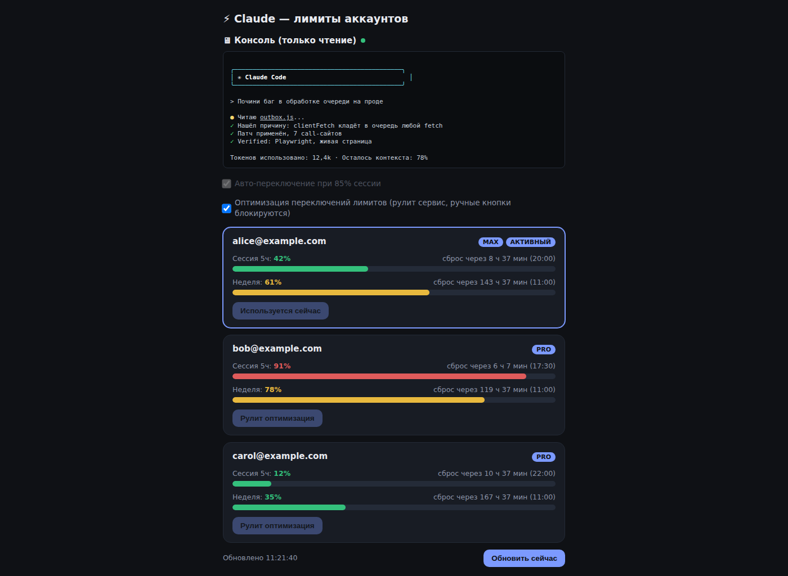

Live console mirror — a read-only copy of what's happening in the Claude
Code `screen` session right now, no SSH needed:

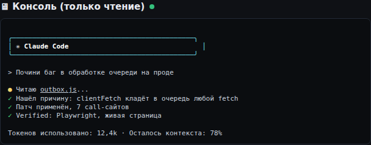

Limit-state banner (v1.2.0) — shows up at the top of the panel only when
there's something to say; in normal operation it isn't rendered at all
(screenshots below are in Russian, the panel itself is RU/EN):

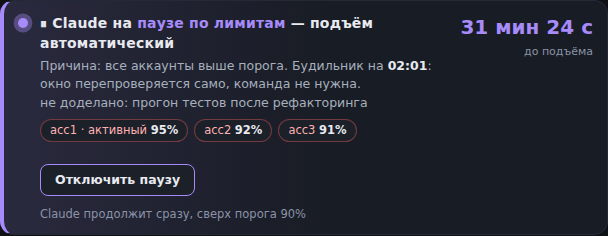
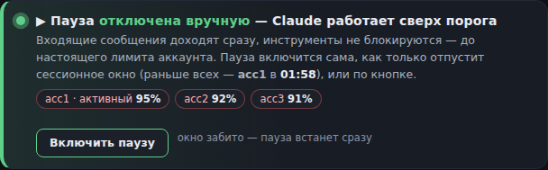
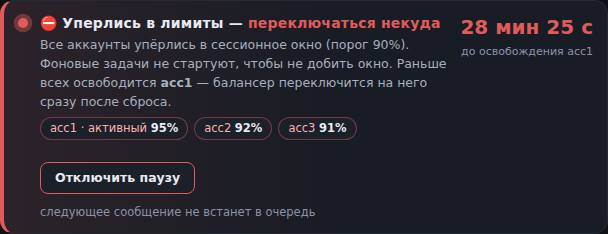
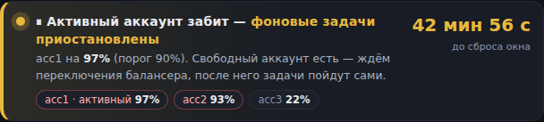

Five looks (v1.16.0) — the classic one and four skins: Phosphor, Aurora,
Slate, Blocks. Switch them in "⚙ Settings"; the browser remembers the choice:

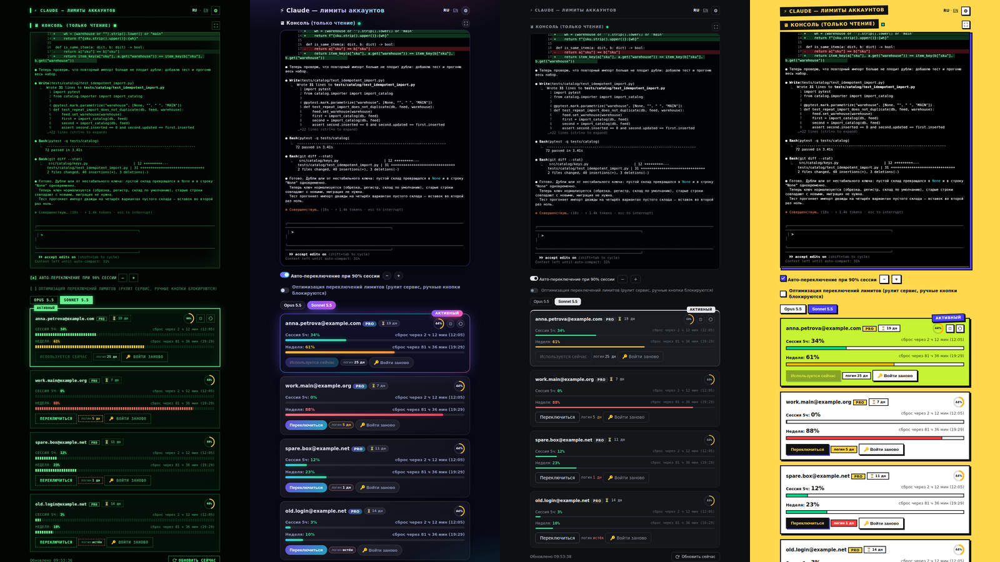

The page fits the window (v1.19.2) — the header, the console and the cards fit
without page scrolling: the console takes all the free space, the accounts sit
in a row. The "−/+" in the console corner change only the console font (click
the percentage to reset to 100%):

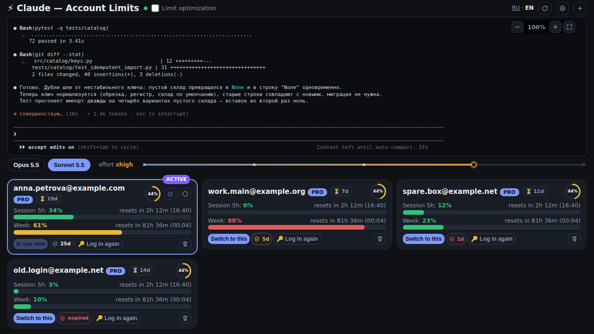

"Console only" mode (the ⛶ button in the console corner; leave it with the same
button or Esc) — the console fills the screen, the accounts hide in a panel at
the bottom edge:

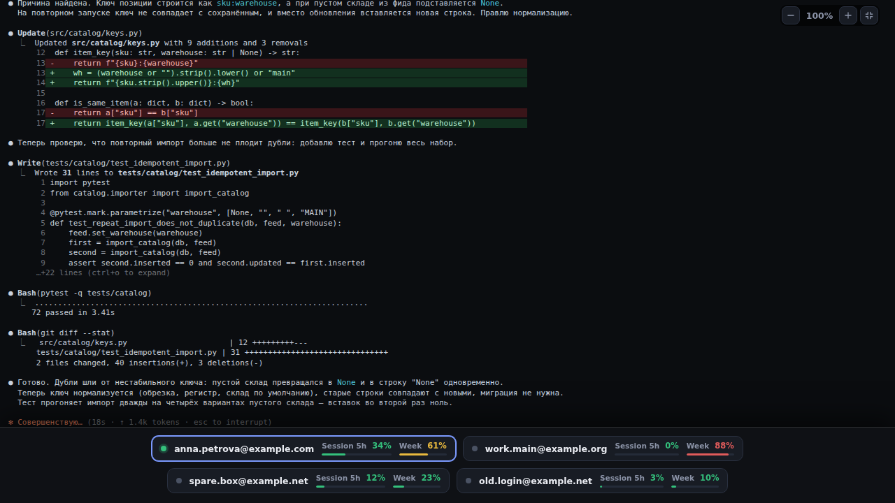

On a smartphone (left — the normal view, right — "console only" with the accounts
panel open; on a phone it opens by tapping the tab):

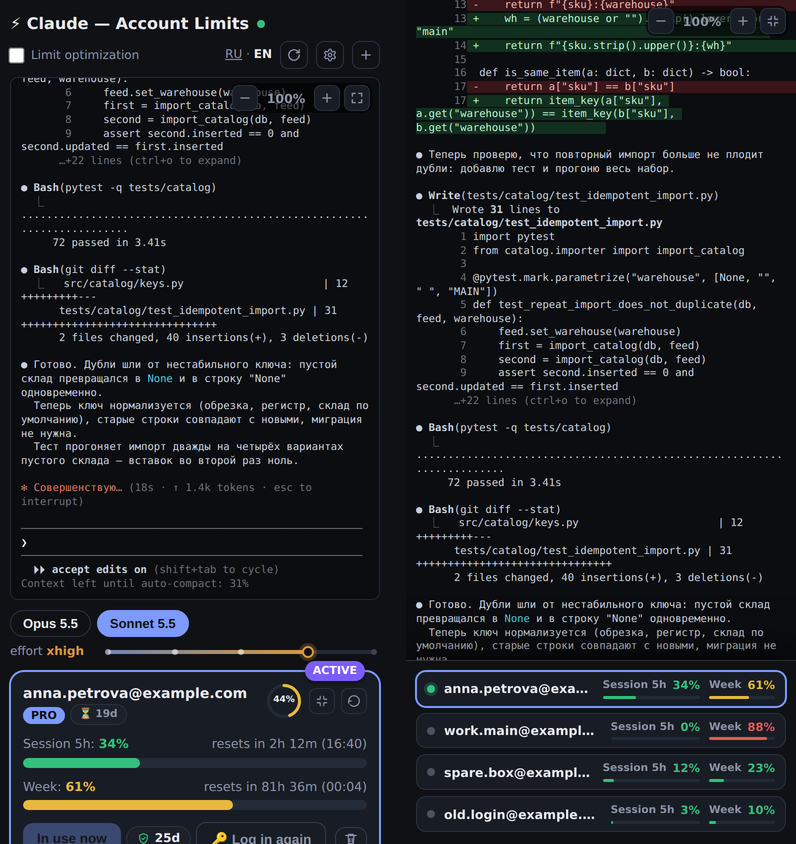

Picking a look in settings:

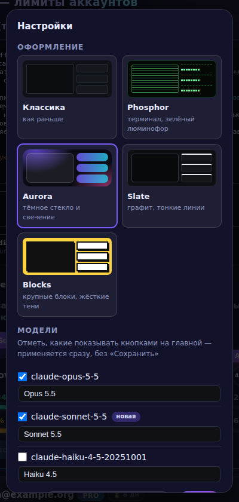

Updates from the panel (v1.18.0) — the "New version released" banner in three looks
and the "Updates" block in "⚙ Settings" (manual / automatic; the screenshots show
the Russian UI, the panel is bilingual):

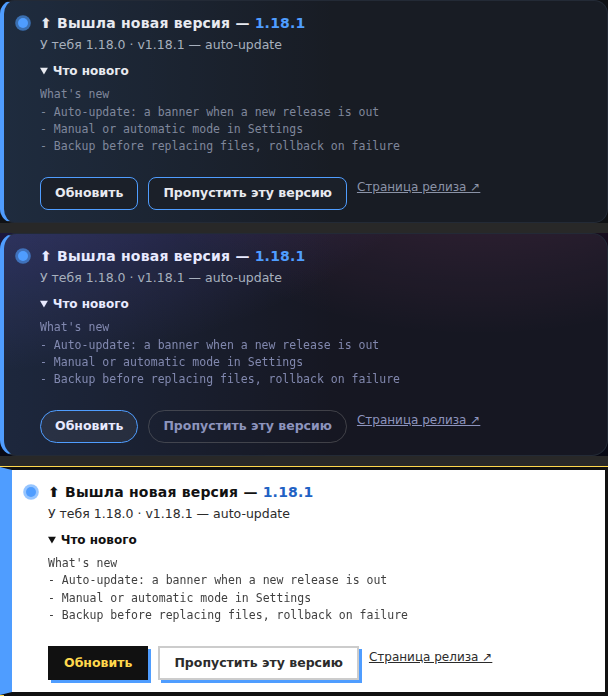
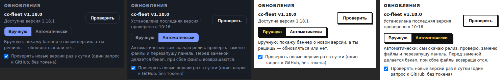

Adding and deleting accounts (v1.19.0) — a "+" button in the header next to the
gear, a "Delete" button on every card and the windows for both flows
(deleting only works after typing the confirmation word):

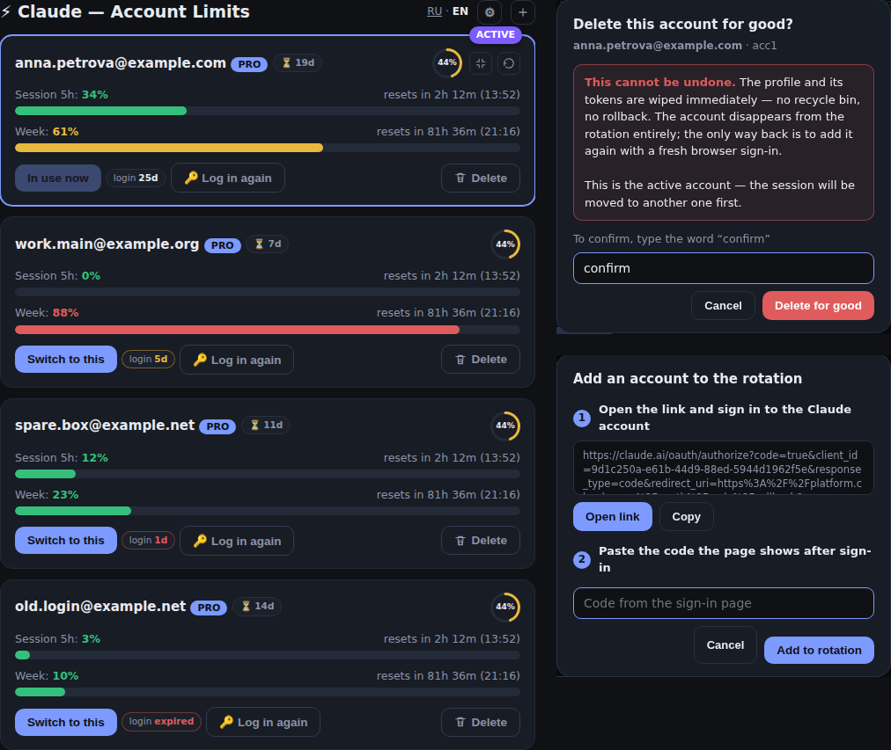

## Features

- 📊 **Multi-account limit monitoring** at once — 5-hour window and weekly
  quota, with a countdown to reset.
- 🔁 **Auto-switch** the active account at a configurable session-usage
  threshold (checkbox in the panel, threshold as a slider/field).
- 🎯 **Limit optimization mode** — the service itself decides which account
  to use right now, to stretch the combined limit across all accounts;
  manual switch buttons are blocked while it runs.
  A planned switch (v1.19.3) waits for a pause between turns of the live
  session, at most 15 minutes (`opt_defer_max_sec`, 0 = do not wait): switching
  accounts mid-turn drops the prompt cache, and on Sonnet 5.5 also the
  reasoning of that turn. Emergency moves (session threshold, weekly limit,
  fall to Free) happen at once, as before.
- 🖥 **Live console mirror** — the same `screen` session visible in your
  terminal, streamed to the browser in real time (read-only).
- 🚦 **Gate for background jobs** (`limits_gate.py`) — one line in your own
  script keeps cron runs and watchers from starting while the active account
  has already burned its window: otherwise they eat exactly the limit you
  need for yourself.
- ⏸ **Limit pause with an alarm** (`pause_ctl.py`) — when the active account
  is above the 5-hour window threshold and there is nothing to switch to (the
  others have their session or week full), work
  goes on pause, and a system cron lifts it at the nearest window reset and
  wakes the live session. The weekly cap triggers the pause only with "Pause at
  the weekly cap" enabled (v1.21.0). Nothing lives
  inside the Claude Code session itself, so the pause survives a restart,
  `/clear` and a reboot.
- ▶️ **"Disable pause" button** in the panel banner — keep working past the
  threshold when you really need to; "Enable pause" puts it back, and if you
  forget, the pause re-enables itself as soon as the window frees up.
- 🛑 **Tool brake** (a `PreToolUse` hook) — when the pause goes up, the turn
  Claude Code is already in stops too: it gets a couple of minutes to bring
  the current action to a consistent state, then tools stay closed until the
  alarm.
- 📥 **Incoming queue while limits are burnt** (`tg_queue.py` + a
  `UserPromptSubmit` hook) — while the windows are burnt, a message from a
  chat channel (Telegram and the like) never reaches the model: it goes into a
  queue, the hook answers the sender itself ("got it, back around 16:03"), and
  the queue is worked through after the wake-up. Without it every new message
  wakes the session and burns what is left of the window, while the person in
  the chat is sure their messages are piling up.
- 🎨 **Five looks** (v1.16.0) — classic, Phosphor (green phosphor terminal),
  Aurora (dark glass), Slate (graphite, thin lines), Blocks (bold blocks).
  Gear → "Look": preview cards, the choice is remembered in the browser, no
  external fonts or requests — system typefaces only. Pure CSS driven by a
  `data-skin` attribute; the markup and logic are the same for every look.
- 🖥 **The page fits the window** (v1.19.2) — the header, the console and the
  cards fit without page scrolling: the console takes the remaining height, the
  account cards sit in a row across the window. The "−/+" in the console corner
  change only the console font (remembered, click the percentage for 100%), and
  the block sizes do not jump.
- ⛶ **Console only** (v1.19.2) — the ⛶ button in the console corner: the console
  fills the screen (and the browser's full screen where it supports it), the
  accounts live in a panel at the bottom edge (on hover, on a phone — by tapping
  the "Accounts" tab). Leave with the same button or Esc; the mode is remembered.
  The console is scrolled to the latest lines by itself and does not jerk while
  you read further up.
- 📱 **Smartphone** (v1.19.2) — the header in two rows, the console ≈62% of the
  screen height, `─` rules are fitted to the width, "−/+" and ⛶ sit inside the
  console frame, the accounts panel in "console only" is a column.
- ✋ **Confirmation for model and effort changes** (v1.19.2) — tapping a model
  button or the effort bar asks "are you sure?", so they are not changed by
  accident while scrolling (especially on a phone). Tapping the effort level that
  is already selected does nothing.
- 🎚 **Effort levels per model** — `/api/limits` returns, for every model, the
  list of effort levels it supports (read from the catalog baked into the
  Claude Code binary; an unknown model is never blocked), and setting a level
  the model does not accept is rejected with a clear message.
- ⏳ **Login expiry on the card** (v1.17.0) — next to "Log in again" there is a
  "login N d" chip: how long is left until the date after which the account
  drops with "Login expired". The date comes from `refreshTokenExpiresAt` in
  `credentials.json` (an absolute date, ≈28 days after a real `/login`; an
  ordinary token refresh does not extend it). ≤3 days is red, ≤7 is yellow,
  under a day shows hours, past the date it says "expired"; the tooltip has the
  exact date. Tokens never reach `/api/limits`, only the `login_expires` date
  goes out. Fitted into all five looks.
- ➕ **Adding and deleting accounts from the panel** (v1.19.0) — a
  "+" button in the header next to the gear: sign-in link → code from the
  page → the account joins the rotation by itself. A "Delete" button on the
  card removes an account for good (the profile with its tokens and every
  trace in the snapshot) — if you lose access to an account it no longer sits
  there as dead weight. Confirmation is typing the word "confirm"; there is no
  recycle bin and no undo. Telegram reports both actions. Fitted into all five
  looks, RU/EN.
- 🔄 **Updates from the panel** (v1.18.0) — once a day the panel asks GitHub
  whether a newer release exists and shows a banner "v1.18.1 is out — Update /
  Skip this version". "⚙ Settings" has a **"Manual / Automatic"** switch
  (manual by default): manual installs on a button press, automatic downloads
  the archive, verifies it, replaces the files and restarts the service by
  itself. A backup is made before replacing, and a failed start rolls back
  automatically. Details are in "Updates from the panel". Fitted into all five
  looks, RU/EN. The same block has a collapsed **"Changelog"** row (v1.20.0):
  every version since v1.0.0 — date, title and a couple of points, newest first.
- 🔔 **State banner** at the top of the panel (RU/EN): "limits reached —
  nothing to switch to", "active account is full — background jobs paused",
  "acc1 picked manually", "paused, resuming at 16:03" with a countdown —
  always with the real reason: session above the threshold or week at the cap.
  In normal operation there is no banner.
- 📨 **Telegram notifications** (optional): account switches, "nothing to
  switch to", the pause going up and the alarm lifting it — so you don't have
  to watch the panel. The bot token comes either from the Claude Code Telegram
  channel file or straight from `config.json`.
- 🧠 **Model pool** (gear icon in the header) — check which models show up
  as quick-switch buttons on the main screen; clicking a button switches the
  default session model right away. A newly added model in the pool carries
  a "new" badge for its first 14 days.
- ⏱ **Countdown ring** on every account card, next to the email — its color
  signals urgency (green → yellow → red as the 5-hour window's reset gets
  close).
- ⌨️ **`/compact` and new-session buttons** right on the active account's
  card — no need to switch to the terminal: compact the context or start
  `/clear` with one click (same `screen`-session injection the model buttons
  use).
- 🔐 No OAuth tokens ever leave your machine — everything lives on your own
  server, under your own root.
- 🧩 One install script, no web wizards or dependencies on someone else's
  infrastructure.

## Requirements

- Your own VDS/server (root access), Ubuntu/Debian with `apt`.
- Claude Code installed (`npm i -g @anthropic-ai/claude-code`), the `claude`
  command must be in `PATH` (`install.sh` will warn if it isn't).
- 2+ Pro/Max Claude accounts to rotate between.
- *(optional)* a domain with an A-record pointing at the server — for the
  web panel over HTTPS instead of bare `127.0.0.1:8877`.

## Installation

```bash
git clone https://github.com/r38dark/cc-fleet.git
cd cc-fleet
sudo ./install.sh
```

The installer will ask: the name of the `screen` session Claude Code runs
in, how many accounts to set up, the auto-switch threshold, whether you want
an nginx domain with Basic Auth, and whether you want Telegram
notifications. Then it will, on its own:

1. install `python3-pyte python3-pexpect screen` (+ `nginx apache2-utils` if
   you chose a web domain),
2. copy `cc_limits.py`, `cc_update.py`, `cc_avail.py`, `limits_gate.py`, `pause_ctl.py`, `tg_queue.py` and
   `hooks/queue_on_limits.py` → `/opt/cc-limits`,
   `cc-switch` → `/usr/local/bin/cc-switch`,
3. create N empty profile slots in `/root/.claude-profiles/accN`,
4. generate `config.json` with a random `hook_token` (on a repeat run it
   updates the existing one, keeping your token and your keys),
5. install and start the systemd service,
6. install the pause alarm cron job (`/etc/cron.d/cc-limits-pause`, ticking
   once a minute),
7. verify the service actually responds (health-check on `/api/limits` and
   `/api/pause`),
8. *(optional)* set up the nginx vhost + Basic Auth.

Non-interactive, for scripts/CI:

```bash
CC_FLEET_YES=1 sudo -E ./install.sh
```

All parameters are taken from `CC_FLEET_*` environment variables (see the
top of `install.sh`) or their defaults.

HTTPS is set up separately after installation, by hand: if you installed
nginx — `certbot --nginx -d <domain>`.

## Running Claude Code itself inside the screen session

The service only monitors/switches — you start the session itself the
standard way:

```bash
screen -S claude -dm claude
```

(the session name must match the one given to install.sh — `claude` by
default). A live session picks up the token swap on the fly, no restart
needed.

## Onboarding accounts

Either of two ways works — both save the account into
`/root/.claude-profiles/accN/`:

**Via the web "Log in again" button** (`/cc/` panel, if you installed
nginx) — install.sh already created N empty slots
(`oauth_account.json: {}`); the button starts `claude auth login` in an
isolated temp HOME, hands you an OAuth link, you sign in in the browser
under the account you want and paste the code back into the page.

**Manually, if the panel isn't up yet:**

```bash
# inside the screen session from the step above — claude is already open there
/login    # sign in under the account you want, inside the TUI
```

then in a regular shell:

```bash
cc-switch save 1   # saves the CURRENT live session as profile acc1
```

Repeat `/login` + `cc-switch save N` for each next account. To check what
the service sees: `cc-switch list`.

## Adding and deleting accounts (v1.19.0)

**Why this became necessary.** An account can become unreachable: access to
its mailbox or phone is lost and a fresh sign-in ("Log in again" asks for a
confirmation in the browser) is no longer possible. A login lives ≈28 days from
a real `/login` and is not extended (see the "login N d" chip on the card) —
once it runs out the account starts failing with "Login expired" and there is
nothing to log it in again with. The dead account stays in the rotation: a card
with an error, wasted requests, warnings. Before, the only way to drop it was
by hand on the file system. Now it is done from the panel, and a new account is
added the same way without SSH.

### Deleting an account for good

The **"Delete"** button on a card → a window with a red **"This cannot be
undone"** warning. The **"Delete for good"** button stays disabled until you
type the word **"confirm"** (the Russian UI asks for «подтверждаю»); case and
surrounding spaces do not matter. Both the page and the server check the word —
an API request without it deletes nothing. Esc, "Cancel" and a click on the
backdrop close the window without doing anything.

- **What is wiped:** the whole profile folder `/root/.claude-profiles/accN/`
  (the tokens live there), the account's rows in the snapshot, caches and
  service state, and the "active" mark. There is no recycle bin and no undo: the
  account disappears from the rotation and from the screen; the only way back
  is adding it again (a fresh browser sign-in).
- **The active account** can be deleted: the live session is first moved to
  another suitable account (not Free, preferably with limit to spare). If there is nowhere
  to move it, the deletion refuses and nothing is wiped.
- **The last account** in the rotation cannot be deleted.
- After a deletion `cc-switch` simply no longer sees the profile.

### Adding an account

The **"+"** button in the header (next to the "Models" gear, tooltip "Add an account") → a window:

1. the account's email (optional — it pre-fills the sign-in page so you do not
   have to type it again) → **"Get the sign-in link"**;
2. open the link, sign in to the Claude account you want, paste the code from
   the sign-in page → **"Add to rotation"**.

A few seconds later there is a new card and the account takes part in
auto-switching — nothing to configure by hand.

- The sign-in runs in an isolated temp HOME (like "Log in again"), the live
  Claude Code session is not touched.
- The new profile takes the first empty installer slot, otherwise the next
  `accN` number.
- The same account cannot be added twice: "already in the rotation as accN".
- A Free account is added but stays out of auto-switching until it is Pro
  (Telegram warns about it).
- An abandoned attempt (link fetched, code never entered) is dropped by itself
  after about 10 minutes (checked on every limits poll) or by a new attempt.

### Telegram and API

If Telegram is set up, one message per action, for example:
`🗑 Claude: аккаунт acc3 (…) удалён из ротации навсегда — …` and
`➕ Claude: аккаунт acc4 (…, PRO) добавлен в ротацию. Теперь в ротации: 3
(acc1, acc2, acc4).` (the bot's texts are Russian, as all of its messages).

API (all with `?token=<hook_token>`, a JSON body; the optional `lang` field,
`ru`/`en`, picks the language of the text in the response):

| Request | What it does |
|---|---|
| `POST /api/account/delete` `{"account":"acc3","confirm":"confirm"}` | delete an account for good; without the right word — `ok:false`, nothing deleted |
| `POST /api/account/add/start` `{"email":""}` | start a sign-in → `{url, slot}` |
| `POST /api/account/add/submit` `{"slot":"acc4","code":"…"}` | finish the sign-in with the code from the page → the account is in the rotation |

## Background-job gate and limit pause (v1.2.0)

Rotation answers "which account should I work on". Two cases are left open:
background (headless) jobs quietly eating the active account's window, and
the moment when **every** account is above the threshold.

**The gate.** `limits_gate.py` is a short script that talks through its exit
code: `10` — do not start now, `0` — go ahead. Put it at the top of your own
cron script:

```bash
python3 /opt/cc-limits/limits_gate.py || exit 0   # rc=10 — just don't start
```

It blocks while the active account's session is above the threshold: either
waiting for the balancer to move to a fresh one, or there is nothing to switch
to (the others have their session or week full — v1.21.6), and the verdict
says which. If `snapshot.json` is missing or stale, the gate **lets the
job through** (fail-open): an extra run beats a silently dead daemon.

**The pause.** `pause_ctl.py` keeps its state in `pause_state.json` next to
the snapshot, and a system cron job (`/etc/cron.d/cc-limits-pause`, ticking
once a minute) wakes it — which is why the pause survives a session restart,
`/clear` and a reboot.

```bash
python3 /opt/cc-limits/pause_ctl.py set --reason "all accounts above threshold" \
        --note "what's left unfinished — I'll see it on wake-up"
python3 /opt/cc-limits/pause_ctl.py status      # current state + gate verdict
python3 /opt/cc-limits/pause_ctl.py clear       # lift it by hand
```

The resume time comes from the nearest 5-hour window reset across all
accounts (+3 minutes — a window doesn't free up instantly). On every tick the
cron job re-checks the gate: still red — it silently moves the alarm to the
new window and bumps the re-check counter; green — it lifts the pause and
"types" a wake-up line into the Claude Code `screen` session (`screen -X
stuff`) so the work continues on its own. The message is overridable via the
`pause_wake_message` key in `config.json`; it is **strictly ASCII** — a
`screen` started without `-U` takes non-ASCII as byte garbage and throws it
straight into the session's input.

All of this is visible in the panel: `GET /api/pause` returns the very state
`pause_ctl` computes — the banner, the gate and the alarm read the same
files, so the page can't promise one thing while background jobs do another.

With Telegram configured (see below), the pause going up and the wake-up both
arrive as messages, so you don't have to keep the panel open. Silent alarm
re-scheduling (the window hasn't let go yet) is deliberately not sent —
otherwise the bot would write every few minutes; it stays in `pause_wake.log`
and in the re-check counter. Turn the pause messages off with
`"pause_notify": false` in `config.json`.

## Incoming queue while limits are burnt (v1.3.0)

A chat with Claude Code has no queue: every incoming message wakes the
session, and it starts working immediately — including when the windows are
already burnt and there is nothing to work with. The person on the other side
usually assumes their messages are piling up to be handled later. This version
makes that assumption true.

How it works: the `UserPromptSubmit` hook (`hooks/queue_on_limits.py`) looks at
the incoming prompt **before** the model is called. If it is a chat-channel
message (`<channel …>`) and the gate is red, the prompt is blocked (no tokens
spent), the text goes into `tg_queue.jsonl`, the sender gets an
acknowledgement over the Bot API, and the pause is raised automatically so the
cron alarm wakes the session at the nearest window reset. The wake-up message
then carries a line saying "N messages queued — handle them first".

```bash
python3 /opt/cc-limits/tg_queue.py count   # how many are waiting
python3 /opt/cc-limits/tg_queue.py list    # look without marking them
python3 /opt/cc-limits/tg_queue.py take    # hand them over and mark as taken
python3 /opt/cc-limits/tg_queue.py clear   # emergency reset of the queue
```

Only the "there is genuinely nowhere to work" state blocks: the active
account above the threshold with nothing to switch to, or a pause already in
place. If the active account is
burnt but a free one exists, the message goes through as usual — the balancer
will switch by itself. Plain terminal input (no `<channel>` tag) is never
touched, and any error inside the hook also passes the prompt through
(fail-open): the queue must not become the reason messages get lost.

The acknowledgement text is overridden by the `queue_ack_message` key in
`config.json` (placeholders `{n}`, `{line}`, `{when}`), and `"queue_ack":
false` turns it off — the message then just lands in the queue silently.

The hook is wired up by an installer question (it edits
`hooks.UserPromptSubmit` in the Claude Code `settings.json`, keeping a backup
next to it), or by hand:

```json
{ "hooks": { "UserPromptSubmit": [ { "hooks": [ { "type": "command",
  "command": "CC_LIMITS_DIR=/opt/cc-limits /usr/bin/python3 /opt/cc-limits/hooks/queue_on_limits.py" } ] } ] } }
```

⚠️ Claude Code reads `settings.json` at startup — restart the session after
wiring the hook, otherwise it will not be called.

## Disable-pause button and the tool brake (v1.15.0)

**The pause is driven by the active account's 5-hour window.** The "nothing
to switch to" level (`hard`) means the active session is above the threshold
and there is nowhere to go: every other account has its session above the
threshold, its week at the cap, is on Free or has an error (since v1.21.6;
before, only sessions counted, so an account with an empty session but a 100%
week passed for a free one — no pause, and the active account filled up to
100%). The banner and Telegram list what holds each account. The alarm lifts
the pause when the active session resets or another account frees up. The
active account's own week does not set the pause (except for the option
below): the balancer leaves an account at the weekly cap by itself, at once,
without the `switch_cooldown_sec` cooldown (v1.21.6), and background jobs (the
`limits_gate.py` gate, since v1.15.1) are not held by it.

**The exception is the "Pause at the weekly cap" option (v1.21.0).** When the
active account reaches `weekly_cap` (99%) and nothing is fit to switch to, the
level is `week`: the pause goes up the same way, with the same tool brake and
"Disable pause" button. The alarm checks it every minute and lifts it as soon
as there is somewhere to work (another account freed up or the week reset).
With the option off (`"weekly_pause": false`, the default) the level is
`weekrisk`: no pause, and the banner and Telegram warn that the balancer won't
stop the account from filling up to 100%.

**Manual pick (v1.21.6).** Switch manually (the card button or
`/api/switch`) to an account whose session is above the threshold or whose
week is at the cap, and the balancer keeps it until the window holding it
resets or the account hits 100%. No pause meanwhile, the level is `manual`:
the card shows "✋ Picked manually" instead of "In use now", the banner gives
the reason and until when. To bring back automatic choice, switch to a free
account. In optimize mode there are no manual switches, so the rule does not
apply.

**The button.** While the pause is up (or all windows are full), the panel
banner shows a "Disable pause" button. Press it — the pause is lifted, the
session is woken right away with "work past the threshold is allowed", the
incoming queue stops collecting, and the tool hook lets everything through.
The banner turns green, "Pause disabled manually", with an "Enable pause"
button that puts the pause back — if the windows are still full, the pause
goes up immediately with an alarm for the nearest reset. If you never press
"Enable", cron returns the pause to normal operation as soon as the window
frees up (log: "пауза снова включена: окно отпустило"), so a forgotten button
can't leave the pause off forever. Same from the console:

```bash
python3 /opt/cc-limits/pause_ctl.py off --by "me"   # disable the pause
python3 /opt/cc-limits/pause_ctl.py on  --by "me"   # enable it back
```

The panel calls the same thing via `POST /api/pause?token=<hook_token>` with
the body `{"action": "off"}` or `{"action": "on"}`.

**The tool brake.** Without it the pause only silences new incoming messages,
while the turn already in progress keeps going and burns the window until it
ends by itself. The `PreToolUse` hook (`hooks/pause_tool_gate.py`) closes
that: with the pause up, Claude's first tool call is denied with the
instruction "don't start new steps, bring what you started to a consistent
state and write down what's left", then it has 120 seconds for that, after
which every tool is denied until the alarm. If every account is above the
threshold and there is no pause yet, the hook sets it itself. Always let
through: project memory, Claude Code's `settings.json` and hooks, and the
`pause_ctl`/`tg_queue` commands (emergency exit — `pause_ctl.py off` or
`clear`). With the pause disabled by the button everything passes; any error
inside the hook is a pass too.

It is wired up by an installer question (it edits `hooks.PreToolUse` in
`settings.json`, keeping a backup next to it), or by hand:

```json
{ "hooks": { "PreToolUse": [ { "matcher": "*", "hooks": [ { "type": "command",
  "command": "CC_LIMITS_DIR=/opt/cc-limits /usr/bin/python3 /opt/cc-limits/hooks/pause_tool_gate.py" } ] } ] } }
```

## Management

| Command / URL | What it does |
|---|---|
| `cc-switch list` | which profiles exist, which one is active |
| `cc-switch <N>` / `cc-switch next` | manually switch the active session |
| `/cc/` (or `curl 127.0.0.1:8877/api/limits?token=<hook_token>`) | limits, auto-switch, console mirror |
| `curl 127.0.0.1:8877/api/update?token=<hook_token>` | update state: installed and available version, mode, stage, result of the last update |
| `curl 127.0.0.1:8877/api/pause?token=<hook_token>` | banner state: level (`none`/`gate`/`hard`/`week`/`weekrisk`), pause, nearest reset |
| `python3 /opt/cc-limits/limits_gate.py` | may a background job start right now (rc `0`/`10`) |
| `python3 /opt/cc-limits/pause_ctl.py set\|status\|clear` | limit pause with an automatic wake-up |
| `python3 /opt/cc-limits/pause_ctl.py off\|on` | disable the pause (work past the threshold) / enable it back — same as the banner buttons |
| `python3 /opt/cc-limits/tg_queue.py count\|list\|take\|clear` | incoming messages queued while the limits held |
| `/opt/cc-limits/config.json` | `autoswitch`, `threshold`, `optimize`, `poll_sec`, `switch_cooldown_sec`, `chat_id`, `bot_token`, `pause_notify`, `screen_session`, `port`, `pause_wake_message`, `queue_ack`, `queue_ack_message`, `weekly_cap`, `weekly_pause`, `update_mode`, `update_check`, `update_repo`, `service_name`, `opt_defer_max_sec` |
| `/opt/cc-limits/switch_log.jsonl` | audit log: one line per forced-mode moment in optimize mode (threshold crossed, switch blocked by cooldown, no candidate, actual switch) — v1.4.0; `deferred_busy` — a planned switch waits for a pause, `switch` carries `waited_sec`/`busy` — v1.19.3 |

## Updates from the panel (v1.18.0)

Once a day (and on the "Check" button in "⚙ Settings → Updates") the panel makes
**one** request, `GET https://api.github.com/repos/r38dark/cc-fleet/releases/latest`
— no token, nothing about you is sent (with `If-None-Match`, so most of the time
GitHub answers "304, unchanged"). If a newer release exists, a banner with the
release notes and buttons appears at the top of the panel, and — if Telegram is
configured — one message per version.

| Mode | What happens |
|---|---|
| **Manual** (default) | banner + an **Update** button; **Skip this version** hides the banner until the next release (you can still install a skipped one from Settings) |
| **Automatic** | the panel installs a found release by itself; a Telegram message says "updated" or "failed" |

How an update goes (the banner shows the stages):

1. the archive is downloaded **from GitHub only** (every redirect is checked,
   30 MB cap); if GitHub supplies the asset's `sha256`, it is verified;
2. the archive is unpacked into a temp folder with no symlinks and no paths
   escaping it; the list of files to replace comes from the release's
   `update_manifest.json`, writes are only allowed into `/opt/cc-limits` (and
   `cc-switch` in `/usr/local/bin`); every `.py` is compiled and `VERSION` must
   match the release version;
3. a **backup** of the files being replaced goes to `/opt/cc-limits/update_backup/`
   (the last 3 are kept), then the files are swapped and the service restarts;
4. the new version confirms its own start after ≈20 seconds of running. If it
   has not confirmed within 2 minutes (crashed, looping), a separate systemd
   watchdog unit **puts the previous files back** and restarts the service; the
   banner says "failed, the previous version was restored". The automatic mode
   will not install a version that failed to start again by itself (manually —
   the "Retry" button);
5. after the confirmation, open panel tabs reload themselves onto the new
   version (v1.21.1) — unless an account dialog is open, a field has
   unfinished text or full screen is on; then right after that.

Good to know:

- **This runs someone else's code as root.** An update installs whatever is
  published in the repository's release. If you don't want that, keep "Manual"
  (the banner puts the release notes and a link to the page in front of you) or
  turn the check off entirely: the "Check for new versions once a day" box in
  Settings, or `"update_check": false` in `config.json`.
- It needs systemd and an install made by `install.sh` (the unit
  `/etc/systemd/system/<service>.service`; the service name is stored in
  `config.json` as `service_name`). Otherwise the banner only announces the new
  version and tells you to update by hand.
- If a release changes the installation itself (unit, nginx, hooks), the
  auto-update does not install it and asks you to run `sudo ./install.sh` from
  the release archive once.
- **Installs ≤ v1.17.0 need one manual step:** `git pull && sudo ./install.sh`
  (they don't have the updater yet). After that — from the panel.
- `config.json` keys: `update_mode` (`manual`/`auto`), `update_check`
  (`true`/`false`), `update_repo` (default `r38dark/cc-fleet`, for forks),
  `service_name`.
- API: `GET /api/update` (state), `POST /api/update/check|apply|skip|ack`.
- **Changelog** (v1.20.0) — a collapsed row in "⚙ Settings → Updates": version,
  date, title and up to three points, newest first, in the interface language.
  The data is `CHANGELOG.json` in `/opt/cc-limits/` (put there by `install.sh`,
  refreshed by the updater, served by `GET /api/changelog`). Every release adds
  its own entry.

## Upgrading from a previous version

```bash
cd cc-fleet && git pull
sudo ./install.sh          # you can keep the same answers
```

A repeat run is idempotent: the `hook_token` and the keys already in
`config.json` are preserved, account profiles are left alone. What gets
updated is the files in `/opt/cc-limits`, the systemd unit, the cron alarm
and the nginx config (if you chose nginx). If you'd rather not run the
installer again — copy `cc_limits.py`, `cc_update.py`, `cc_avail.py`, `limits_gate.py`, `pause_ctl.py`,
`tg_queue.py`, `hooks/queue_on_limits.py` and `hooks/pause_tool_gate.py` into `/opt/cc-limits`, add the
cron line from `install.sh`, and restart the service.

## Telegram notifications (optional)

What the bot sends:

- account auto-switches (and manual ones, including `cc-switch` from a shell);
- "nothing to switch to" — every account above the threshold; at the weekly cap
  it says what happens: a pause or "the balancer won't stop it at 100%" (v1.21.0);
- an account's week reached the 99% cap — one message per account per week,
  active or not (v1.21.0);
- **the limit pause going up** (until when, window percentages, what was left
  unfinished) and **the pause being lifted by the alarm** (how long it stood,
  how many times the alarm was pushed back) — v1.2.1;
- an account re-logged in through the web button;
- an account **added to the rotation** or **deleted for good** (v1.19.0);
- an account dropping from Pro to Free, and coming back.

Who to write to — the `chat_id` key in `config.json` (`install.sh` asks for
it). The bot token is looked up in two places, in this order:

1. `/root/.claude/channels/telegram/.env` (`TELEGRAM_BOT_TOKEN=...`) — the file
   used by Claude Code's official Telegram channel;
2. the `bot_token` key in `config.json` itself — for when that channel isn't
   set up and you'd rather not set it up (a plain @BotFather token).

Without a `chat_id`, notifications are silently skipped and the service runs
as usual. If a `chat_id` is set but no token is found in either place, the
service says so in its log (`journalctl -u cc-limits`), so a silent bot isn't
a mystery. Pause messages can be turned off on their own with
`"pause_notify": false` in `config.json` (the rest keep coming).

## Without nginx / without a domain

The service listens only on `127.0.0.1:<port>`. Put your own reverse proxy
in front:

- The main page (`GET /`) is only served if the proxy sent an `X-Auth-User`
  header (usually from Basic Auth) — this way the panel never faces the
  internet unauthenticated.
- Every API route (`/api/...`) can be called without that header too — with
  `?token=<hook_token>` in the query string. The panel itself talks to the
  API this way (browsers don't always forward Basic Auth into `fetch()`),
  so you'll typically want TWO proxy locations: one with Basic Auth →
  service root (`X-Auth-User` from the proxy), and one without Auth →
  `/api/` (access gated only by knowing `hook_token`). See the nginx block
  that `install.sh` generates for an example.

## Error codes

What `429`/`400`/`403` on an account card actually means, when each one
really happens, and what to do about it — [ERRORS.en.md](ERRORS.en.md).

## What's NOT included in this package

- A personal agents/supervisor dashboard — a separate layer on top of
  Claude Code, unrelated to account rotation, not part of this repo.
- An "escalation" feature (background cost-escalation monitoring) — cut
  out, specific to a different system.
- HTTPS/certbot — a manual step after `install.sh`.

## Version history

- **v1.21.6** — "nothing to switch to" counts the week: when every other
  account has its session or week full, the pause goes up (before, an account
  with an empty session but a 100% week counted as free, the banner promised
  "the balancer switches", and the active account filled up to 100%). The
  banner names the real reason ("acc1: week 99% — at the 99% cap"), and for
  "nothing to switch to" what holds each account. A manual pick of an account
  with a full session or week holds until the window resets or 100%, labelled
  "Picked manually". Without a manual pick the balancer leaves an account at
  the weekly cap at once, without the cooldown.
- **v1.21.5** — clearer Telegram message about the weekly cap: when the
  balancer moves off an account whose week hit the cap, the message says this
  is a normal account switch, not a pause — “Pause at the weekly cap” only
  acts when there is nowhere to switch.
- **v1.21.4** — “Log in again” opens a side panel with the login link,
  “Open link” / “Copy” buttons and a code field, instead of a new tab and a
  browser prompt; a wrong code offers “Start over”. The console in the
  Phosphor, Aurora, Slate and Blocks themes no longer looks bold: the
  brightness filters that thickened the text are gone.
- **v1.21.3** — the version label no longer takes a line: in 1.21.2 it sat on
  its own line and pushed the cards and console up by 15 px; it now sits in
  the bottom padding under the cards, with the layout as before 1.21.2. 9 px
  font; the label is not clickable or selectable.
- **v1.21.2** — the app version in the bottom-right corner: a small
  "cc-fleet vX.Y.Z" label on the right under the cards, aligned with them, so
  you see at once which version the tab has open. The number is filled in when
  the page is served, so after an update (and the v1.21.1 tab self-reload) it
  shows the new one. Hidden in console-only mode.
- **v1.21.1** — the tab reloads itself after an update. Before, an open panel
  only showed the "Updated" banner after the service updated, while its HTML
  and scripts stayed from the previous version, so new things (such as the
  v1.21.0 checkbox) appeared only after a manual F5. Now the page knows its own
  version and, once the service is on the new one and has confirmed the start,
  reloads itself (within a minute); open "⚙ Settings" come back. The reload
  waits while an add/remove account dialog is open, a field has unfinished
  text, or full screen is on. If the tab is still on the old version after the
  reload, there are no retries: the banner shows a "Reload page" button. It
  works from the next update on: a tab opened on v1.21.0 or earlier needs one
  manual reload.
- **v1.21.0** — weekly 99% cap: an optional pause and warnings. The balancer
  already skipped accounts at 99% of their week (`weekly_cap`), but when the
  active account hit that cap with nowhere to switch, work went on to 100%
  while Telegram said "waiting". Now "⚙ Settings" has a "Pause at the weekly
  cap" option (`weekly_pause`, off by default): with it Claude pauses in that
  case, as on the 5-hour window, and resumes on its own once another account
  frees up or the week resets (or via "Disable pause"). Without it you get a
  red banner and one message, "the balancer won't stop it at 100% — you work
  at your own risk", with a hint where to enable the pause. On top of that,
  any account that reaches 99% of its week, active or not, gets one Telegram
  message per week. The banner timer shows days ("3 d 09 h"), and the reset
  time includes the weekday.
- **v1.20.1** — readable inactive buttons on cards. "In use now" and
  "Optimizer active" were translucent and almost blended into the background;
  now they are an opaque plate with text contrast of 4.5 or higher in all five
  looks. In Blocks it is a white plate with a black border and no shadow (only
  clickable buttons keep the shadow), and the model name field in "⚙ Settings →
  Models" is white with black text.
- **v1.20.0** — changelog in Settings. "⚙ Settings → Updates" has a collapsed
  "Changelog" row under the version line: every version since v1.0.0 (date,
  title, up to three points), newest first, in the interface language,
  scrolling inside the block, the installed version marked. The log is
  `CHANGELOG.json`, it arrives with updates (listed in `update_manifest.json`),
  and the page reads it via `GET /api/changelog`. Fitted into all five looks,
  RU/EN.
- **v1.19.3** — a planned account switch waits for a pause between turns.
  Before, optimize mode switched accounts at any moment, mid-turn included:
  the prompt cache was dropped (the whole long session was re-read at the new
  account's expense), and on Sonnet 5.5 the turn's reasoning was lost too — it
  is bound to the organization. Now the session's busy state is read from the
  spinner line in the console (the watchdog looks every 5 s, a pause is 2
  checks in a row without the spinner); a planned switch waits for a pause up
  to `opt_defer_max_sec` (900 s, 0 = do not wait) and runs as soon as the pause
  starts, without waiting for `poll_sec`. Emergency moves and non-optimize mode
  do not wait. `switch_log.jsonl` gets a `deferred_busy` event and
  `waited_sec`/`busy` fields on every switch.
- **v1.19.2** — the page fits the window, "console only" mode, smartphone. The
  page is no longer squeezed into a 640 px column: the header, the console and
  the cards (in a row, across the window width) fit without page scrolling, and
  the console takes the remaining height. Instead of the "full screen" above the
  console there are "−/+" (console font, remembered) and a ⛶ "console only"
  button: the console fills the screen, the accounts sit in a panel at the
  bottom, opened by hover or by tapping the tab; the console is scrolled down by
  itself and does not jerk while you read further up. The "Updated / Refresh
  now" line is replaced by a refresh icon in the header, all icons are SVG, the
  "login N d" chip is a shield and the term, coloured by urgency. Smartphone:
  the header in two rows, the console ≈62% of the height, `─` rules fitted to
  the width, the console controls inside its frame, the bottom panel as a
  column. Changing the model or effort needs a confirmation. Card errors:
  `_humanize_error` no longer fails on a reply shaped like
  `{"error": {"type": …, "message": …}}`. The update banner shows the release
  notes in the interface language: the release body is split by `## English` /
  `## Русский` headings (older releases without them are shown whole).

- **v1.19.1** — adding an account moved from a tile at the end of the list to a
  compact "+" button in the header next to the "Models" gear (RU/EN tooltip,
  in all five looks): no permanently hanging empty block, and a new card appears
  only once an account has been added. The windows and the API are unchanged.

- **v1.19.0** — adding and deleting accounts from the panel. An "+ Add account"
  tile (email optional → sign-in link → code from the page → the account joins
  the rotation by itself; the sign-in runs in an isolated temp HOME, duplicate
  guard, a Free account is flagged) and a "Delete" button on the card: the
  profile with its tokens and the traces in the snapshot/caches are wiped for
  good, no recycle bin; confirmation is typing the word "confirm" (checked by
  both the page and the server), before deleting the active account the session
  is moved to another one, the last account cannot be deleted. Telegram reports
  a successful add and a successful deletion. Routes
  `/api/account/delete|add/start|add/submit`. The windows are fitted into all
  five looks, RU/EN. It updates from the panel as usual (the "New version
  released" banner on v1.18.x installs).

- **v1.18.0** — updates from the panel. Once a day one request to GitHub
  Releases (no token), a banner "New version released — Update / Skip this
  version" with the release notes, a "Manual / Automatic" switch in "⚙ Settings"
  and a box to turn the check off. Download from GitHub only (redirect checks,
  size cap, the asset's `sha256`), unpacking without links or escaping paths, the
  file list from `update_manifest.json`, `.py` compile and a `VERSION` check
  before replacing; a backup in `update_backup/`, the new version confirms its
  start, and a watchdog in a separate systemd unit rolls back if it did not come
  up. The banner and settings are fitted into all five looks, RU/EN, failure
  reasons are translated. Installs ≤ v1.17.0 need one manual `sudo ./install.sh`.
- **v1.17.0** — login expiry on the account card. `/api/limits` returns
  `login_expires` (an ISO date from `refreshTokenExpiresAt`: for the active
  account from the CLI's live file, for the others from the profile file; no
  field or a broken file — the key is simply absent), and next to "Log in
  again" sits a "login N d" chip: ≤3 days red, ≤7 yellow, under a day shows
  hours, past the date "expired", the exact date in the tooltip. Tokens never
  go out. The chip is fitted into the classic look and the four skins (readable
  on the active card in Blocks too), RU/EN.
- **v1.16.0** — looks and full-screen console. Five looks (classic, Phosphor,
  Aurora, Slate, Blocks) in "⚙ Settings": pure CSS driven by `data-skin`, the
  choice lives in `localStorage`, and an early inline script in `<head>` sets
  the skin before first paint (no flash). The ⛶ button opens the console full
  screen (≈70/30 with the accounts below, "Whole console"/"Large" font fit,
  exit with ✕/Esc/Back). The controls row and the "I renewed" button were
  redone for each look. `effort`: `/api/limits` returns the supported levels
  per model, and an unavailable level is not applied. The default classic look
  is unchanged. Also: the default `screen` session name in `/api/effort` is
  now `claude`, like everywhere else (it was a private name).
- **v1.15.1** — the background-job gate `limits_gate.py` no longer looks at
  the weekly cap: it holds on the 5-hour window only, same as the live-session
  pause. Before, accounts at 99–100% weekly stopped background runs until the
  week reset — a day or longer.
- **v1.15.0** — the pause is driven by the 5-hour window only: weekly limits no
  longer set it (before, accounts at 99–100% weekly gave "nothing to switch
  to" while their sessions were free). "Disable pause" / "Enable pause"
  buttons in the banner and `pause_ctl.py off|on`: a disabled pause
  re-enables itself once the window frees up. New `PreToolUse` hook
  `hooks/pause_tool_gate.py` — the pause also stops the turn already in
  progress, not just new incoming messages; the installer offers to wire it up.
- **v1.14.2** — the live session `effort` is read from its transcript: the last
  `/effort` output or the `effort` field of the latest assistant turn. This also
  catches `max`, which Claude Code applies to the current session only and never
  writes to `settings.json`. Falls back to model settings, the status line and the
  top-level `effortLevel`.
- **v1.14.1** — effort is read where Claude Code actually stores it: `/effort`
  saves the level per model in `modelSettings[<id>].effortLevel`, not in the
  top-level `effortLevel`, so the API kept reporting the old level after a switch.
  `effort`/`effort_default` now come from the session model's settings (falling
  back to the status line and the top-level `effortLevel`); `POST /api/effort`
  writes there too.
- **v1.14.0** — session effort over the API. `model` in `/api/limits` now carries
  `effort` (the live session level from the status line, falling back to
  `effortLevel` in `settings.json`), `effort_default` and the `efforts` list
  (low … max). New `POST /api/effort {"effort": "high"}` writes `effortLevel` to
  `settings.json` and best-effort sends `/effort <level>` to the console — same
  approach as `/api/model`: it applies if the session is idle right now.
- **v1.13.0** — notice on automatic model switches. The Claude Code runtime
  sometimes hands the session to another model on its own — e.g. Opus 5.5
  safeguards flag the session and Opus 4.8 answers from then on, with no menu
  and nothing written to `settings.json`. The balancer watchdog compares the
  model in the session status line with the default in `settings.json` and
  sends «model switched automatically: A → B» to Telegram, with the reason
  (safeguard, when it is visible on screen) and how to switch back; when the
  model matches the default again, a second message follows. Switches via
  `/model` or the «Model» button are not reported (they change the default
  too). Status lines with `│` separators («Opus 5.5 │ 45% │ …») are now parsed.
- **v1.12.0** — console choice menus are forwarded to Telegram. Claude Code
  sometimes stops on an interactive menu (e.g. «Model switch» when Opus 5.5
  safeguards falsely flag a message) and waits for a key — until someone gets
  to the console, the session is stuck. The balancer watchdog now spots such a
  menu and sends its text with a button per option; pressing one types the
  choice into the console (one-time link `/cc-hook/dialog/answer`). If the menu
  is closed in the console, the buttons are removed. Requires `chat_id` and
  `public_url` in `config.json` (`install.sh` with nginx sets
  `https://<domain>` itself); without `public_url` you get the menu text only.
- **v1.11.1** — the «Check for new models» button now works on any install:
  it scans the installed Claude Code itself (`claude` from PATH, npm or native
  install) and offers model IDs newer than the ones already listed (e.g. Opus
  5.5 when Opus 5 is known). Previously it only read the optional release
  watcher's state file, which a normal install doesn't have, so it silently
  showed nothing. Now every click gives feedback: «N found» or «no new models».
  Opus 5.5 is added to the built-in list.
- **v1.11.0** — the balancer picks the next account by when it actually
  frees up, not just by its session reset. An account is usable when its
  session is below the threshold **and** its week is below `weekly_cap`; its
  free-up time is the reset of whichever window (or both) holds it. The rule
  lives in a shared module, `cc_avail.py`, used by the balancer, the banner
  (`pause_ctl.py`) and the gate (`limits_gate.py`). Before, with the active
  account at 100% weekly, the banner claimed "a free account exists", the
  timer counted down to the active account's session reset, and a neighbour
  that freed up minutes later was noticed very late. Changes:
  - leaves an account at 100% session or week immediately, ignoring
    `switch_cooldown_sec`;
  - simple mode (`autoswitch`) respects the week too;
  - `poll_loop` wakes up at the nearest reset of any window (+15 s);
  - an inactive account's cache is dropped once one of its windows has reset;
  - the 429 back-off is per account, not global;
  - the web page no longer polls Anthropic itself, it only reads the snapshot;
  - the banner says who frees up first and what holds it; chips show the
    week.
- **v1.10.2** — the “until PRO→FREE” countdown could stay stuck on the old
  date after a renewal: the anchor was only written on a fully clean
  “✅ I renewed” response. If Anthropic still reported Free at click time, or
  the plan was already Pro but the usage endpoint errored (a 429 right after
  payment is common), no date was saved; the background poll later sent
  “PRO again — back in rotation” but left the anchor alone → the card kept
  showing “⏳ today”. Now the button writes the anchor for any Pro/Max plan
  (a usage error no longer blocks it), and the background poll sets the
  anchor itself on a Free→Pro transition — at the button click time (if
  clicked within the last 6 h) or at detection time. This also removes the
  cold-start gap: after the first natural Free→Pro the countdown appears
  even without the button.
- **v1.10.1** — reset times in TG notifications/cards (`_local_hm()`) used
  to render in the timezone of the SERVER running cc-limits — if your
  self-host lives in a different region than you do, the shown reset time
  silently didn't match reality. New optional `"tz"` key in `config.json`
  (an IANA zone name, e.g. `"Asia/Irkutsk"` or `"Europe/Moscow"`) — when
  set, reset times are always explicitly converted to it, regardless of
  where the server physically runs. Without the key, behavior is unchanged
  (server's own zone, as before).
- **v1.10.0** — "optimize" mode: the last-resort fallback (when no candidate
  passes even the relaxed 97% session-load bar) no longer switches to an
  account whose weekly limit is already maxed out. That branch previously
  only checked 5-hour session load — an account with a low session% but a
  100% weekly limit still looked like the "best" candidate, the balancer
  would switch to it and get stuck there for good (nowhere left to go from
  there). The weekly cap (`weekly_cap`) is now enforced in this branch too,
  same as everywhere else.
- **v1.9.9** — live console mirror: underline (`text-decoration:underline`)
  is no longer rendered at all. A fresh (non-`--continue`) claude session
  could hit a terminal quirk where SGR-underline stayed "stuck" across most
  of the screen (tens of percent of cells, including the status bar) —
  visually it looked like stripes under every line. Since a fully-underlined
  screen never carries useful signal in this mirror, the attribute is simply
  never drawn, regardless of the terminal-side cause.
- **v1.9.8** — live console mirror: window geometry (rows/cols) is now read
  honestly via `ioctl(TIOCGWINSZ)` directly on the screen window's pty
  device, instead of a "tight box" fit around the hardcopy text (which
  drifted with content). The read never touches screen's command channel —
  no side effects on the live session's screen at any poll frequency.
- **v1.9.7** — the `weekly_cap` threshold (the weekly-usage level at which
  an account counts as exhausted for optimize mode — it both forces a
  leave off the active account and excludes a candidate from being a
  switch target) was raised from 95% to 99%. At 95% there was still a
  meaningful chunk of unused headroom left — an account with a nearly
  empty session but 95-98% weekly could never become a switch target
  (short of the deepest fallback tier, which ignores weekly entirely),
  even though it could still do useful work. A pure numeric threshold
  change, the filter logic itself is unchanged.
- **v1.9.6** — the "🔑 Log in again" relogin link is now automatically
  copied to the clipboard the moment the new tab opens — no more
  right-clicking to copy it by hand when the tab opens in the wrong
  browser profile or gets blocked by a popup blocker; just paste it
  wherever it's needed. The code-entry prompt now mentions this.
- **v1.9.5** — the PRO→FREE countdown moved into a compact "⏳ N days" chip
  right in the card header, next to the plan tag, instead of a separate
  line under the 5h/week bars — less vertical space, a red accent when
  fewer than 3 days remain (the title shows the exact date). Purely a
  visual refactor of the existing v1.9.4 feature — the logic/anchor is
  unchanged.
- **v1.9.4** — countdown to expected subscription end, shown on the account
  card. The "✅ I renewed" button now, besides its instant plan recheck,
  also records the confirmation moment (`state.json["renewal"][acc]`) —
  from there the app computes "anchor minus a 30-minute buffer, plus one
  calendar month" (`dateutil.relativedelta`, not a fixed 30 days, so the
  date doesn't drift on longer months), and the card shows a line like
  "until expected PRO→FREE: ~N d Hh (DD.MM)". The existing instant Telegram
  alert on an actual Pro→Free drop is unchanged — the countdown is just an
  early heads-up, not a replacement. Also fixed a neighboring bug in the
  same handler: `/api/recheck` decided success from `plan` alone, ignoring
  `error` — plan and usage are independent Anthropic endpoints, so plan
  could already be back to Pro while usage was still 429'ing, and the
  button happily said "back in rotation" even though auto-switching still
  hard-skips any account with a non-empty `error`. Now `plan ok + error`
  gets its own honest message instead of a false "success". New
  dependency: `python3-dateutil` (added to `install.sh`).
  **Cold-start note:** the anchor is only written inside `/api/recheck`,
  and the "✅ I renewed" button only shows once the plan has already
  dropped to `free`. On a fresh install, before an account has ever
  dropped to Free, there is no countdown line — it appears only after the
  first natural Pro→Free cycle, once you've renewed and clicked "I
  renewed". Until then, the only safety net is the instant Telegram alert
  on an actual Pro→Free drop (see above), which works independently of
  the countdown.
- **v1.9.3** — fixed a pause-wake "stuck input" bug: when waking the paused
  session (`pause_ctl.py wake`), the wake message text and Enter are now
  sent to screen as TWO separate `stuff` calls with a short pause between
  them, instead of one `text + "\r"` call. A long string injected in one
  `stuff` call could sit in the TUI's input box unsubmitted — the terminal
  accepted the characters, but the trailing `\r` didn't act as submit
  (resembles bracketed-paste: a batch of bytes arriving all at once is
  treated as a paste, not as "typed then pressed Enter"). Short commands
  were unaffected — only long wake messages were.
- **v1.9.2** — account card errors are now translated into a plain-language
  message instead of the raw `HTTP Error 400: Bad Request`: expired token
  ("log in again"), rate limit (429), WAF block (403), temporary Anthropic
  outage (5xx), network/timeout — each with a short next step. The HTTP
  error body is parsed once, right where the exception is caught (an
  `HTTPError`'s body can only be read once), and an unrecognized code is
  shown as-is with its number rather than guessed at. Note: this message
  comes from the backend, not the frontend i18n layer, so — like other
  backend-generated strings in this project (`cc-switch` output, session
  commands) — it's Russian-only regardless of the language toggle; see
  [ERRORS.md](ERRORS.md) / [ERRORS.en.md](ERRORS.en.md) for the full
  bilingual breakdown of each error code.
- **v1.9.1** — two background-polling fixes: (1) `poll_loop()` now
  respects `backoff_until` itself after a caught 429 — it used to call
  `collect(force=True)` unconditionally on every tick, and `force=True`
  bypasses both the 30-second dedup and the backoff, so the background
  poller kept hitting Anthropic and could get rate-limited again before
  the backoff even expired (a regression against the v1.8.0 fix, which
  only closed the non-force path from the panel); (2) when there is
  nowhere left to switch to (every account's session is above threshold),
  a single Telegram notification now fires per episode (at most once
  every 2 hours) with each account's status and the nearest reset time,
  instead of staying silent.
- **v1.9.0** — the model modal (⚙) is now a single list: known models and
  discovered candidates (via "🔄 Check for new models") show together, each
  row is one checkbox that applies immediately (a known model toggles
  on/off, a candidate is added and enabled in the same click — no separate
  "Add" step). Rows are grouped by model family (Fable/Opus/Sonnet/…), with
  Haiku always sorted last as the lightest tier, and newer versions listed
  above older ones within a family.
- **v1.8.0** — after a 429 from Anthropic, any non-force request (a regular
  panel poll) is now blocked for twice `poll_sec`, not just the background
  poller's own timer. Previously the 30-second dedup in `collect()` only
  guarded against simultaneous calls: if the panel polled `/api/limits` less
  often than 30s but before the background poller had a chance to back off,
  it would immediately repeat the very request that had just been
  rate-limited.
- **v1.7.0** — each account card now shows a countdown ring for the 5-hour
  window's reset (color signals urgency — green/yellow/red), and the active
  account's card gets two buttons right on it — compact the context
  (`/compact`) and start a new session (`/clear`) — no need to switch to the
  terminal. The "ACTIVE" tag also moved from an inline badge next to the
  email into a floating pill straddling the card's top border, so the active
  account stands out at a glance.
- **v1.6.0** — inactive accounts are no longer polled on every tick: if an
  account already has a fresh cache (younger than `inactive_poll_sec`,
  300s by default), the real Anthropic request is skipped and cached data
  is reused, tagged with its age (`stale_ts`). The active account is still
  polled fresh every tick — no slowdown in reacting to a forced switch.
  Matters when `poll_sec` is set low for a snappier reaction — that used
  to double the request rate to ALL accounts at once and could trip
  `429 Too Many Requests` on the inactive ones. The "I renewed" button
  (`/api/recheck`) explicitly bypasses the cache — it needs a guaranteed
  fresh read.
- **v1.5.0** — model pool with checkboxes: the gear icon in the header opens
  a modal listing every known model, and a checkbox enables/disables each one
  in the quick-switch button row on the main screen — applies instantly, no
  Save button. Clicking a model button switches the session default
  (`POST /api/model` — the endpoint already existed, but the panel never
  called it; switching a model used to mean typing `/model` by hand inside
  the session itself). A newly added entry in `MODELS` gets a "new" badge
  for 14 days (`model_added_ts` in `config.json`).
- **v1.4.1** — the panel finally has a real threshold control (a "−"/"+"
  button pair next to the auto-switch checkbox, step 5%, range 50–99%): the
  README used to promise a "slider/field" for the threshold, but the panel
  only ever shipped a checkbox and a static number — changing it required
  hand-editing `config.json` on the server. The backend (`/api/config`)
  already accepted `threshold` before this — the UI control was the only
  missing piece.
- **v1.4.0** — in optimize mode, the emergency session ceiling (forced
  switch) now shares the same `threshold` field as regular auto-switch:
  it used to read a separate `opt_ses_ceil` key that nothing ever set
  (not the installer, not the panel), so the slider looked like it was
  wired up while the real emergency ceiling stayed untouched. Also a new
  `switch_log.jsonl` audit log — one JSON line per forced-mode moment
  (threshold crossed, switch blocked by cooldown, no suitable candidate,
  actual switch performed) — so "why didn't it switch sooner" can be
  answered from facts instead of the single last-switch timestamp that
  used to be all that was kept.
- **v1.3.0** — incoming queue while limits are burnt: a `UserPromptSubmit`
  hook blocks a chat-channel message before it reaches the model, stores it in
  `tg_queue.jsonl` and answers the sender itself; after the alarm wakes the
  session the queue is worked through in order.
- **v1.2.1** — Telegram notifications when the pause goes up and when the
  alarm lifts it; the bot token can now be set with the `bot_token` key in
  `config.json` instead of only through the Claude Code Telegram channel file
  (without that channel the bot used to stay silent with no explanation); a
  `pause_notify` switch.
- **v1.2.0** — limit gate for background jobs (`limits_gate.py`), a pause
  with an alarm that outlives the session (`pause_ctl.py` + cron), the state
  banner in the panel and `GET /api/pause`, idempotent re-runs of
  `install.sh`.
- **v1.1.0** — RU/EN panel UI, fixed the web "Log in again" button.
- **v1.0.0** — first release: limit monitoring, auto-switching, console
  mirror, `cc-switch`, installer.

## License

[MIT](LICENSE)
