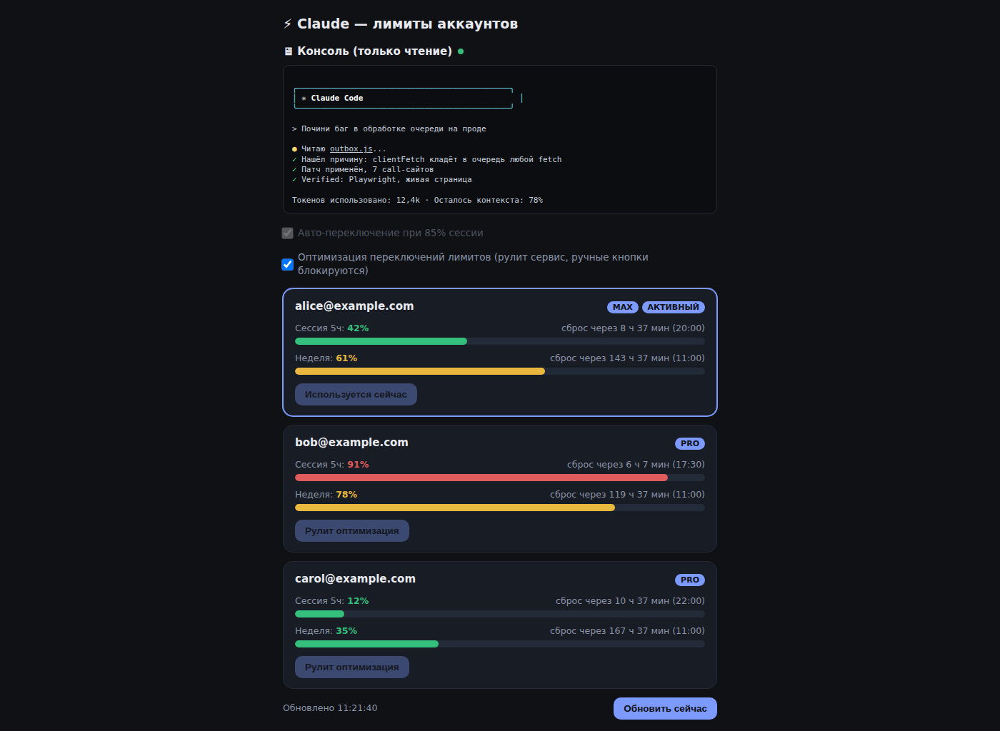
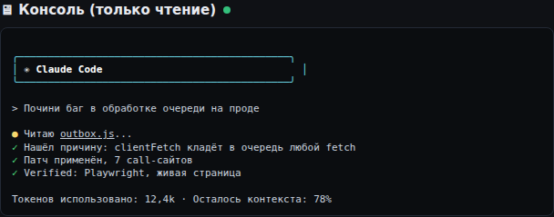
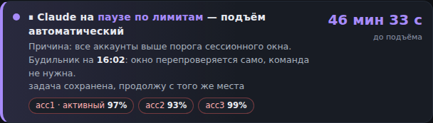
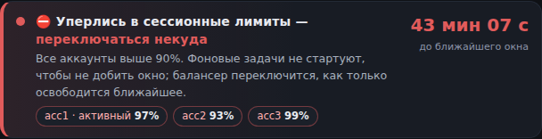
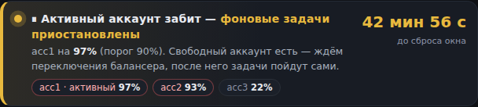

# ⚡ cc-fleet

🇷🇺 Русский · [🇬🇧 English](README.en.md)

**Self-host дашборд для ротации нескольких аккаунтов Claude Code по лимитам.**

Мониторит лимиты (5 часов / неделя) сразу нескольких Pro/Max-аккаунтов на
одной VDS, автоматически переключает активную сессию по достижении порога и
показывает live-зеркало консоли работающего Claude Code — всё в одной
веб-панели, без сторонних сервисов и облаков.

А когда переключаться уже некуда — ставит работу на паузу и сам снимает её,
как только ближайшее окно сбросится.

[](LICENSE)
[](install.sh)
[](cc_limits.py)

---

## Скриншоты

Панель аккаунтов — карточки с процентом заполнения 5-часовой и недельной
сессии, активный аккаунт подсвечен:



Live-зеркало консоли — read-only копия того, что происходит в `screen`-сессии
Claude Code прямо сейчас, без SSH:



Баннер состояния лимитов (v1.2.0) — появляется вверху панели, только когда
есть что сказать; в обычном режиме его не видно совсем:





## Возможности

- 📊 **Мониторинг лимитов** нескольких аккаунтов сразу — 5-часовое окно и
  недельная квота, с обратным отсчётом до сброса.
- 🔁 **Авто-переключение** активного аккаунта по настраиваемому порогу
  заполнения сессии (галочка в панели, порог — ползунок/поле).
- 🎯 **Режим оптимизации лимитов** — сервис сам решает, каким аккаунтом
  пользоваться прямо сейчас, чтобы растянуть суммарный лимит по всем
  аккаунтам; ручные кнопки переключения на время его работы блокируются.
- 🖥 **Live-зеркало консоли** — та же `screen`-сессия, что видна в терминале,
  транслируется в браузер в реальном времени (только чтение).
- 🚦 **Гейт для фоновых задач** (`limits_gate.py`) — одна строка в чужом
  скрипте, и cron-прогоны/вотчеры не стартуют, пока активный аккаунт уже
  выбрал окно: иначе они добивают именно тот лимит, который нужен тебе.
- ⏸ **Пауза по лимитам с будильником** (`pause_ctl.py`) — когда все аккаунты
  выше порога и переключаться некуда, работа встаёт на паузу, а системный
  cron сам снимает её на ближайшем сбросе окна и будит живую сессию. Ничего
  не живёт внутри самой сессии Claude Code, поэтому пауза переживает
  перезапуск, `/clear` и ребут.
- 📥 **Очередь входящих на время лимитов** (`tg_queue.py` + хук
  `UserPromptSubmit`) — пока окна сожжены, сообщение из чат-канала (Telegram и
  т.п.) не доходит до модели: оно ложится в очередь, отправителю отвечает сам
  хук («принял, вернусь в 16:03»), а разбирается очередь после подъёма. Без
  этого каждое новое сообщение будит сессию и добивает остаток окна, хотя
  человек в чате уверен, что его сообщения копятся.
- 🔔 **Баннер состояния** вверху панели (RU/EN): «упёрлись в лимиты —
  переключаться некуда», «активный аккаунт забит — фоновые задачи стоят»,
  «на паузе, подъём в 16:03» с обратным отсчётом. В норме баннера нет.
- 📨 **Уведомления в Telegram** (опционально): переключение аккаунтов,
  «переключаться некуда», постановка паузы и подъём по будильнику — чтобы не
  сидеть в панели. Токен бота — из файла телеграм-канала Claude Code или
  прямо из `config.json`.
- 🔐 Ничьи OAuth-токены никуда не улетают — всё живёт на твоём собственном
  сервере, под твоим root.
- 🧩 Один установочный скрипт, без веб-визардов и внешних зависимостей от
  чужой инфраструктуры.

## Требования

- Свой VDS/сервер (root-доступ), Ubuntu/Debian с `apt`.
- Установленный Claude Code (`npm i -g @anthropic-ai/claude-code`), команда
  `claude` должна быть в `PATH` (`install.sh` предупредит, если её нет).
- 2+ Pro/Max-аккаунта Claude, между которыми нужно переключаться.
- *(опционально)* домен с A-записью на сервер — для веб-панели по HTTPS
  вместо голого `127.0.0.1:8877`.

## Установка

```bash
git clone https://github.com/r38dark/cc-fleet.git
cd cc-fleet
sudo ./install.sh
```

Установщик спросит: имя `screen`-сессии, где живёт Claude Code, сколько
аккаунтов завести, порог авто-переключения, нужен ли nginx-домен с Basic
Auth, нужны ли уведомления в Telegram. Дальше сам:

1. поставит `python3-pyte python3-pexpect screen` (+ `nginx apache2-utils`,
   если выбран веб-домен),
2. скопирует `cc_limits.py`, `limits_gate.py`, `pause_ctl.py` →
   `/opt/cc-limits`, `cc-switch` → `/usr/local/bin/cc-switch`,
3. заведёт N пустых слотов-профилей в `/root/.claude-profiles/accN`,
4. сгенерирует `config.json` со случайным `hook_token` (при повторном запуске
   — обновит существующий, не трогая токен и твои ключи),
5. поставит и запустит systemd-сервис,
6. поставит cron-будильник паузы (`/etc/cron.d/cc-limits-pause`, тик раз в
   минуту),
7. проверит, что сервис реально отвечает (health-check `/api/limits` и
   `/api/pause`),
8. *(опционально)* настроит nginx vhost + Basic Auth.

Без вопросов — для скриптов/CI:

```bash
CC_FLEET_YES=1 sudo -E ./install.sh
```

Все параметры берутся из переменных окружения `CC_FLEET_*` (см. шапку
`install.sh`) или из значений по умолчанию.

HTTPS после установки настраивается отдельно, вручную: если ставил nginx —
`certbot --nginx -d <домен>`.

## Как запустить сам Claude Code в screen-сессии

Сервис только мониторит/переключает — саму сессию поднимаешь стандартно:

```bash
screen -S claude -dm claude
```

(имя сессии должно совпадать с указанным в install.sh — по умолчанию
`claude`). Живая сессия подхватывает подмену токенов на лету, рестарт не
требуется.

## Онбординг аккаунтов

Двух способов достаточно, оба сохраняют аккаунт в
`/root/.claude-profiles/accN/`:

**Через веб-кнопку «Войти заново»** (панель `/cc/`, если ставил nginx) —
install.sh уже завёл N пустых слотов (`oauth_account.json: {}`), кнопка
стартует `claude auth login` в изолированном temp-HOME, отдаёт ссылку OAuth,
логинишься в браузере под нужным Claude-аккаунтом и вводишь код обратно на
странице.

**Вручную, если панель ещё не поднята:**

```bash
# в screen-сессии из предыдущего шага — там уже открыт claude
/login    # логинишься под нужным аккаунтом внутри TUI
```

затем в обычном шелле:

```bash
cc-switch save 1   # сохраняет ТЕКУЩУЮ живую сессию как профиль acc1
```

Повтори `/login` + `cc-switch save N` для каждого следующего аккаунта.
Проверить, что видит сервис: `cc-switch list`.

## Гейт для фоновых задач и пауза по лимитам (v1.2.0)

Ротация решает вопрос «на каком аккаунте работать». Остаются два случая,
которые она не закрывает: фоновые (headless) задачи, которые молча съедают
окно активного аккаунта, и момент, когда **все** аккаунты выше порога.

**Гейт.** `limits_gate.py` — короткий скрипт с кодом возврата: `10` — сейчас
запускаться нельзя, `0` — можно. Ставится в начало любого своего cron-скрипта:

```bash
python3 /opt/cc-limits/limits_gate.py || exit 0   # rc=10 — просто не стартуем
```

Блокирует в двух случаях: активный аккаунт выше порога (ждём, пока балансер
уйдёт на свежий) или все аккаунты выше порога (переключаться некуда). Если
`snapshot.json` пропал или протух — гейт **пропускает** (fail-open): лучше
лишний прогон, чем молча стоящий демон.

**Пауза.** `pause_ctl.py` держит состояние в `pause_state.json` рядом со
снапшотом, а будит его системный cron (`/etc/cron.d/cc-limits-pause`, тик раз
в минуту) — поэтому пауза переживает перезапуск сессии, `/clear` и ребут.

```bash
python3 /opt/cc-limits/pause_ctl.py set --reason "все аккаунты выше порога" \
        --note "что не доделано — увижу при подъёме"
python3 /opt/cc-limits/pause_ctl.py status      # что сейчас + вердикт гейта
python3 /opt/cc-limits/pause_ctl.py clear       # снять руками
```

Время подъёма берётся из ближайшего сброса 5-часового окна среди всех
аккаунтов (+3 минуты, окно отпускает не мгновенно). На каждом тике cron
перепроверяет гейт: красный — молча переносит будильник на новое окно и растит
счётчик перепроверок, зелёный — снимает паузу и «печатает» в `screen`-сессию
Claude Code сообщение о подъёме (`screen -X stuff`), чтобы работа продолжилась
сама. Текст сообщения переопределяется ключом `pause_wake_message` в
`config.json`; он **строго ASCII** — `screen`, поднятый без `-U`, принимает
не-ASCII побайтовым мусором и швыряет его прямо во ввод сессии.

Всё это видно в панели: `GET /api/pause` отдаёт то же состояние, которое
считает `pause_ctl`, — баннер, гейт и будильник смотрят в одни и те же файлы,
поэтому страница не может обещать одно, а фоновые задачи вести себя иначе.

Если настроен Telegram (см. ниже), о постановке паузы и о подъёме приходит
уведомление — в панель для этого заглядывать не нужно. Молчаливые переносы
будильника (окно ещё не отпустило) в бот не идут, иначе он писал бы каждые
несколько минут; они видны в `pause_wake.log` и в счётчике перепроверок.
Отключается ключом `"pause_notify": false` в `config.json`.

## Очередь входящих на время лимитов (v1.3.0)

У чата с Claude Code нет очереди: каждое входящее сообщение будит сессию, и та
немедленно берётся за работу — в том числе когда окна уже сожжены и работать
нечем. Человек при этом обычно уверен, что его сообщения копятся и будут
разобраны позже. Эта версия делает такое поведение настоящим.

Работает так: хук `UserPromptSubmit` (`hooks/queue_on_limits.py`) смотрит на
входящий промпт **до** обращения к модели. Если это сообщение из чат-канала
(`<channel …>`) и гейт «красный» — промпт блокируется (токены не тратятся),
текст ложится в `tg_queue.jsonl`, отправителю уходит подтверждение через Bot
API, а пауза поднимается автоматически, чтобы cron-будильник разбудил сессию
на ближайшем сбросе окна. В сообщении о подъёме появляется строка «в очереди N
сообщений — разбери их первым делом».

```bash
python3 /opt/cc-limits/tg_queue.py count   # сколько ждёт
python3 /opt/cc-limits/tg_queue.py list    # посмотреть, не помечая
python3 /opt/cc-limits/tg_queue.py take    # выдать и пометить разобранными
python3 /opt/cc-limits/tg_queue.py clear   # аварийный сброс очереди
```

Блокируется только состояние «работать реально негде»: все аккаунты выше
порога либо пауза уже стоит. Если активный аккаунт сожжён, но свободный есть,
сообщение проходит как обычно — балансер переключится сам. Обычный ввод в
терминале (без `<channel>`-тега) хук не трогает вообще, любая ошибка внутри
хука — тоже пропуск (fail-open): очередь не должна становиться причиной, по
которой сообщения теряются.

Текст подтверждения переопределяется ключом `queue_ack_message` в
`config.json` (плейсхолдеры `{n}`, `{line}`, `{when}`), отключается ключом
`"queue_ack": false` — тогда сообщение просто молча ляжет в очередь.

Хук подключается вопросом установщика (правит `hooks.UserPromptSubmit` в
`settings.json` Claude Code, делая бэкап рядом) либо руками:

```json
{ "hooks": { "UserPromptSubmit": [ { "hooks": [ { "type": "command",
  "command": "CC_LIMITS_DIR=/opt/cc-limits /usr/bin/python3 /opt/cc-limits/hooks/queue_on_limits.py" } ] } ] } }
```

⚠️ Claude Code читает `settings.json` при старте — после подключения хука
сессию надо перезапустить, иначе он не будет вызываться.

## Управление

| Команда / URL | Что делает |
|---|---|
| `cc-switch list` | какие профили есть, какой активен |
| `cc-switch <N>` / `cc-switch next` | переключить активную сессию вручную |
| `/cc/` (или `curl 127.0.0.1:8877/api/limits?token=<hook_token>`) | лимиты, авто-переключение, зеркало консоли |
| `curl 127.0.0.1:8877/api/pause?token=<hook_token>` | состояние баннера: уровень (`none`/`gate`/`hard`), пауза, ближайший сброс |
| `python3 /opt/cc-limits/limits_gate.py` | можно ли сейчас запускать фоновую задачу (rc `0`/`10`) |
| `python3 /opt/cc-limits/pause_ctl.py set\|status\|clear` | пауза по лимитам с автоматическим подъёмом |
| `python3 /opt/cc-limits/tg_queue.py count\|list\|take\|clear` | очередь входящих, накопленных пока держались лимиты |
| `/opt/cc-limits/config.json` | `autoswitch`, `threshold`, `optimize`, `poll_sec`, `switch_cooldown_sec`, `chat_id`, `bot_token`, `pause_notify`, `screen_session`, `port`, `pause_wake_message`, `queue_ack`, `queue_ack_message` |
| `/opt/cc-limits/switch_log.jsonl` | аудит-лог: по строке на каждый forced-момент режима оптимизации (порог пробит, свитч заблокирован кулдауном, кандидата нет, сам свитч) — v1.4.0 |

## Обновление с предыдущей версии

```bash
cd cc-fleet && git pull
sudo ./install.sh          # ответы можно оставить прежними
```

Повторный запуск идемпотентен: `hook_token` и уже настроенные ключи
`config.json` сохраняются, профили аккаунтов не трогаются. Обновятся файлы в
`/opt/cc-limits`, systemd-unit, cron-будильник и nginx-конфиг (если выбирал
nginx). Если ставить установщик повторно не хочется — достаточно скопировать
`cc_limits.py`, `limits_gate.py`, `pause_ctl.py`, `tg_queue.py` и
`hooks/queue_on_limits.py` в `/opt/cc-limits`, положить cron-строку из
`install.sh` и перезапустить сервис.

## Telegram-уведомления (опционально)

Что приходит в бот:

- авто-переключение аккаунта (и ручное, и сделанное `cc-switch` из консоли);
- «переключаться некуда» — все аккаунты выше порога;
- **пауза по лимитам поставлена** (до какого времени, проценты окон, что
  осталось незакрытым) и **пауза снята будильником** (сколько простояли,
  сколько раз будильник переносился) — v1.2.1;
- перелогин аккаунта через веб-кнопку;
- слёт аккаунта с Pro на Free и возврат обратно.

Кому слать — ключ `chat_id` в `config.json` (спрашивает `install.sh`). Токен
бота берётся из двух мест, в таком порядке:

1. `/root/.claude/channels/telegram/.env` (`TELEGRAM_BOT_TOKEN=...`) — файл
   официального Telegram-канала Claude Code;
2. ключ `bot_token` в самом `config.json` — если канал не настроен и заводить
   его не хочется (обычный токен от @BotFather).

Без `chat_id` уведомления тихо пропускаются, сервис работает как обычно. Если
`chat_id` задан, а токена нет ни там ни там — сервис пишет об этом в свой лог
(`journalctl -u cc-limits`), чтобы молчание бота не выглядело загадкой.
Уведомления про паузу отключаются отдельно: `"pause_notify": false` в
`config.json` (остальные при этом продолжают ходить).

## Без nginx / без домена

Сервис слушает только `127.0.0.1:<port>`. Подключай свой reverse-proxy:

- Главная страница (`GET /`) отдаётся, только если прокси прислал заголовок
  `X-Auth-User` (обычно из Basic Auth) — так панель не смотрит наружу голой.
- Все API (`/api/...`) можно дёргать и без этого заголовка — с
  `?token=<hook_token>` в query. Панель сама так и ходит (браузер не всегда
  пробрасывает Basic Auth в `fetch()`), поэтому обычно нужны ДВЕ location у
  прокси: одна с Basic Auth → корень сервиса (`X-Auth-User` от прокси),
  вторая без Auth → `/api/` (доступ только по знанию `hook_token`). Пример —
  в блоке nginx, который генерирует `install.sh`.

## Что НЕ входит в этот пакет

- Личный дашборд агентов/супервизора — отдельная надстройка поверх Claude
  Code, к ротации аккаунтов не относится, тут её нет.
- Функция «escalation» (мониторинг фоновых cost-эскалаций) — вырезана,
  специфична для другой системы.
- HTTPS/certbot — шаг после `install.sh`, вручную.

## История версий

- **v1.4.1** — в панели наконец появилась реальная кнопка изменения порога
  (кнопки «−»/«+» рядом с чекбоксом авто-переключения, шаг 5%, диапазон
  50–99%): раньше README обещал «ползунок/поле» для порога, а на деле в
  панели была только галочка и статичная цифра — поменять число можно было
  только вручную правкой `config.json` на сервере. Бэкенд (`/api/config`)
  и раньше принимал `threshold` — не хватало только элемента управления в
  интерфейсе.
- **v1.4.0** — в режиме оптимизации лимитов аварийный порог сессии
  (форс-уход) объединён с одним и тем же полем `threshold`, что и у обычного
  авто-переключения: раньше форс-уход в оптимизации читал отдельный ключ
  `opt_ses_ceil`, который нигде не выставлялся (ни установщиком, ни панелью),
  поэтому число на слайдере визуально выглядело рабочим, а на реальный
  аварийный потолок не влияло. Плюс новый аудит-лог `switch_log.jsonl` —
  по одной JSON-строке на каждый forced-момент (порог пробит, свитч
  заблокирован кулдауном, подходящего кандидата нет, сам свитч выполнен) —
  чтобы разбирать «почему не переключилось раньше» по фактам, а не по
  единственному сохранённому таймстампу последнего переключения.
- **v1.3.0** — очередь входящих на время лимитов: хук `UserPromptSubmit`
  блокирует сообщение из чат-канала до обращения к модели, кладёт его в
  `tg_queue.jsonl` и отвечает отправителю сам; после подъёма по будильнику
  очередь разбирается по порядку.
- **v1.2.1** — уведомления в Telegram о постановке паузы и о подъёме по
  будильнику; токен бота можно задать ключом `bot_token` в `config.json`, а не
  только через файл телеграм-канала Claude Code (раньше без канала бот молчал
  вообще, ничего об этом не сообщая); выключатель `pause_notify`.
- **v1.2.0** — гейт лимитов для фоновых задач (`limits_gate.py`), пауза с
  будильником, переживающим сессию (`pause_ctl.py` + cron), баннер состояния
  в панели и `GET /api/pause`, идемпотентный повторный запуск `install.sh`.
- **v1.1.0** — RU/EN-интерфейс панели, починена веб-кнопка «Войти заново».
- **v1.0.0** — первый релиз: мониторинг лимитов, авто-переключение,
  зеркало консоли, `cc-switch`, установщик.

## Лицензия

[MIT](LICENSE)
