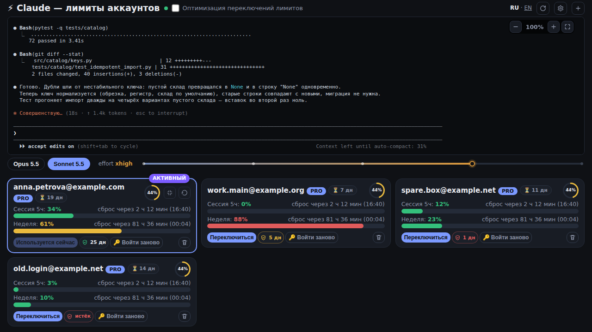
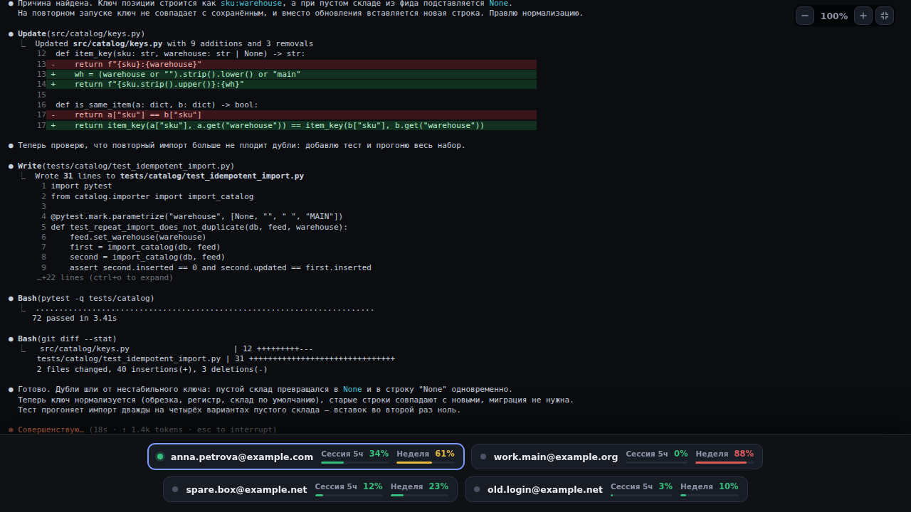
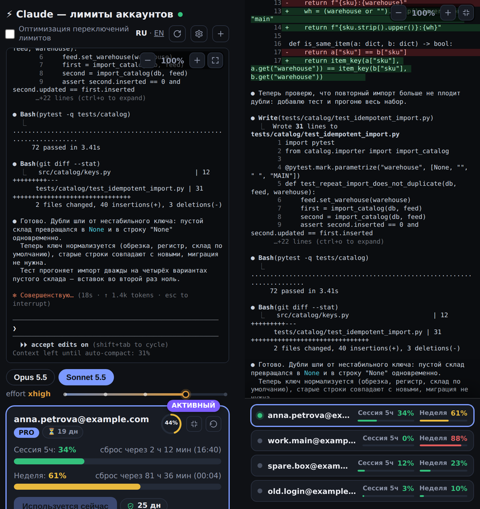
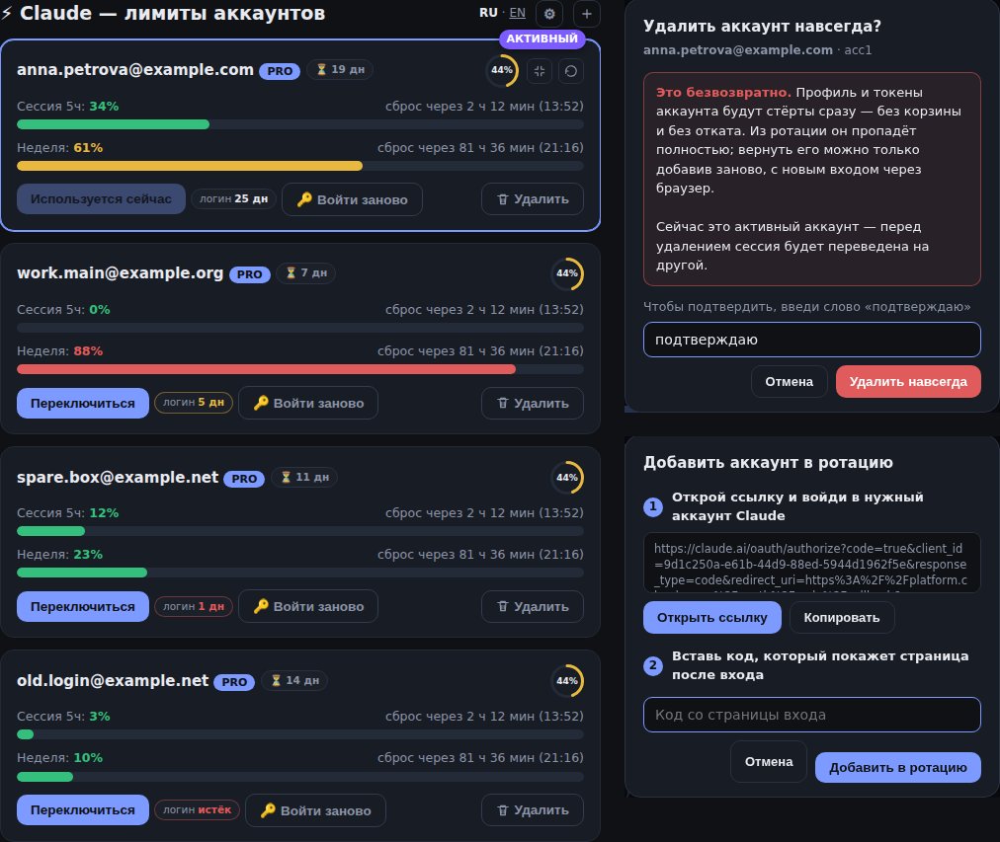

# ⚡ cc-fleet

🇷🇺 Русский · [🇬🇧 English](README.en.md)

**Self-host дашборд для ротации нескольких аккаунтов Claude Code по лимитам.**

Мониторит лимиты (5 часов / неделя) сразу нескольких Pro/Max-аккаунтов на
одной VDS, автоматически переключает активную сессию по достижении порога и
показывает live-зеркало консоли работающего Claude Code — всё в одной
веб-панели, без сторонних сервисов и облаков.

А когда переключаться уже некуда — ставит работу на паузу и сам снимает её,
как только ближайшее окно сбросится.

[](LICENSE)
[](install.sh)
[](cc_limits.py)

---

## Скриншоты

Панель аккаунтов — карточки с процентом заполнения 5-часовой и недельной
сессии, активный аккаунт подсвечен:


Live-зеркало консоли — read-only копия того, что происходит в `screen`-сессии
Claude Code прямо сейчас, без SSH:


Баннер состояния лимитов (v1.2.0) — появляется вверху панели, только когда
есть что сказать; в обычном режиме его не видно совсем:


Пять оформлений (v1.16.0) — классика и четыре скина: Phosphor, Aurora, Slate,
Blocks. Переключаются в «⚙ Настройки», выбор помнит браузер:


Страница вписана в окно (v1.19.2) — шапка, консоль и карточки помещаются без
прокрутки страницы: консоль забирает всё свободное место, аккаунты идут в ряд.
«−/+» в углу консоли меняют только шрифт консоли (клик по проценту — 100%):



Режим «только консоль» (кнопка ⛶ в углу консоли; выход — она же или Esc) —
консоль на весь экран, аккаунты прячутся в панель у нижнего края:



На смартфоне (слева — обычный вид, справа — «только консоль» с открытой панелью
аккаунтов; на телефоне она открывается касанием язычка):



Выбор оформления в настройках:


Обновления из панели (v1.18.0) — баннер «Вышла новая версия» в трёх оформлениях
и блок «Обновления» в «⚙ Настройки» (вручную / автоматически):


Добавление и удаление аккаунтов (v1.19.0) — кнопка «+» в шапке рядом с
шестерёнкой, кнопка «Удалить» на каждой карточке и окна обоих сценариев (удаление —
только после ввода слова «подтверждаю»):



## Возможности

- 📊 **Мониторинг лимитов** нескольких аккаунтов сразу — 5-часовое окно и
  недельная квота, с обратным отсчётом до сброса.
- 🔁 **Авто-переключение** активного аккаунта по настраиваемому порогу
  заполнения сессии (галочка в панели, порог — ползунок/поле).
- 🎯 **Режим оптимизации лимитов** — сервис сам решает, каким аккаунтом
  пользоваться прямо сейчас, чтобы растянуть суммарный лимит по всем
  аккаунтам; ручные кнопки переключения на время его работы блокируются.
  Плановое переключение (v1.19.3) ждёт паузы между ходами живой сессии — не
  дольше 15 минут (`opt_defer_max_sec`, 0 — не ждать): смена аккаунта посреди
  хода сбрасывает кэш промпта, а у Sonnet 5.5 ещё и рассуждения этого хода.
  Аварийные уходы (порог сессии, неделя, слёт в Free) — сразу, как и раньше.
- 🖥 **Live-зеркало консоли** — та же `screen`-сессия, что видна в терминале,
  транслируется в браузер в реальном времени (только чтение).
- 🚦 **Гейт для фоновых задач** (`limits_gate.py`) — одна строка в чужом
  скрипте, и cron-прогоны/вотчеры не стартуют, пока активный аккаунт уже
  выбрал окно: иначе они добивают именно тот лимит, который нужен тебе.
- ⏸ **Пауза по лимитам с будильником** (`pause_ctl.py`) — когда все аккаунты
  выше порога 5-часового окна и переключаться некуда, работа встаёт на паузу,
  а системный cron сам снимает её на ближайшем сбросе окна и будит живую
  сессию. Недельный потолок ставит паузу, только если включить «Пауза на
  недельном потолке» (v1.21.0). Ничего не живёт внутри самой
  сессии Claude Code, поэтому пауза переживает перезапуск, `/clear` и ребут.
- ▶️ **Кнопка «Отключить паузу»** в баннере панели — работать сверх порога,
  когда очень надо; «Включить паузу» ставит её обратно, а если не нажать —
  пауза включится сама, как только окно отпустит.
- 🛑 **Стоп-кран инструментов** (хук `PreToolUse`) — встала пауза, и уже
  начатый ход Claude Code тоже останавливается: даётся пара минут довести
  действие до целостного состояния, потом инструменты закрыты до будильника.
- 📥 **Очередь входящих на время лимитов** (`tg_queue.py` + хук
  `UserPromptSubmit`) — пока окна сожжены, сообщение из чат-канала (Telegram и
  т.п.) не доходит до модели: оно ложится в очередь, отправителю отвечает сам
  хук («принял, вернусь в 16:03»), а разбирается очередь после подъёма. Без
  этого каждое новое сообщение будит сессию и добивает остаток окна, хотя
  человек в чате уверен, что его сообщения копятся.
- 🎨 **Пять оформлений** (v1.16.0) — классика, Phosphor (зелёный люминофор),
  Aurora (тёмное стекло), Slate (графит, тонкие линии), Blocks (крупные блоки).
  Шестерёнка → «Оформление»: карточки с превью, выбор запоминается в браузере,
  без внешних шрифтов и запросов — только системные гарнитуры. Всё — чистый CSS
  через атрибут `data-skin`, разметка и логика у всех оформлений одни.
- 🖥 **Страница вписана в окно** (v1.19.2) — шапка, консоль и карточки
  помещаются в окно без прокрутки страницы: консоль забирает остаток высоты,
  карточки аккаунтов идут в ряд по ширине окна. «−/+» в углу консоли меняют
  только шрифт консоли (запоминается, клик по проценту — 100%), размеры блоков
  при этом не прыгают.
- ⛶ **Только консоль** (v1.19.2) — кнопка ⛶ в углу консоли: консоль на весь
  экран (и на весь экран браузера, где он это умеет), аккаунты — в панели у
  нижнего края (по наведению, на телефоне — по язычку «Аккаунты»). Выход —
  та же кнопка или Esc, режим запоминается. Консоль сама прокручена к
  последним строкам и не дёргается, пока читаешь выше.
- 📱 **Смартфон** (v1.19.2) — шапка в два ряда, консоль ≈62% высоты экрана,
  линии из `─` подгоняются под ширину, «−/+» и ⛶ лежат внутри рамки консоли,
  панель аккаунтов в режиме «только консоль» — колонкой.
- ✋ **Подтверждение смены модели и effort** (v1.19.2) — нажатие на кнопку
  модели или на полосу effort спрашивает «точно?», чтобы не сменить их
  случайно при прокрутке (особенно на телефоне). Нажатие на уже выбранный
  уровень effort ничего не делает.
- 🎚 **Уровни effort по модели** — `/api/limits` отдаёт для каждой модели
  список поддерживаемых уровней (из каталога, зашитого в бинарник Claude Code;
  неизвестная модель не блокируется), а установка уровня, который модель не
  принимает, отклоняется с понятным текстом.
- ⏳ **Срок логина на карточке** (v1.17.0) — рядом с «Войти заново» чип
  «логин N дн»: сколько осталось до даты, после которой аккаунт отвалится с
  «Login expired». Дата берётся из `refreshTokenExpiresAt` в `credentials.json`
  (абсолютная, ≈28 дней от настоящего `/login`; обычное обновление токена её
  не продлевает). ≤3 дней — красный, ≤7 — жёлтый, меньше суток — часы, после
  срока — «истёк»; в подсказке — точная дата. Токены в `/api/limits` не
  попадают, наружу идёт только дата `login_expires`. Вписан во все пять
  оформлений.
- ➕ **Добавление и удаление аккаунтов из панели** (v1.19.0) — кнопка
  «+» в шапке рядом с шестерёнкой: ссылка входа → код со страницы → аккаунт
  сам встаёт в ротацию. Кнопка «Удалить» на карточке убирает аккаунт навсегда
  (профиль с токенами и все следы в снимке) — потерял доступ к аккаунту, и он
  больше не висит мёртвым грузом. Подтверждение — вводом слова «подтверждаю»,
  корзины и отката нет. Telegram сообщает об обоих действиях. Вписано во все
  пять оформлений, RU/EN.
- 🔄 **Обновления из панели** (v1.18.0) — раз в сутки панель спрашивает у GitHub,
  нет ли релиза новее, и показывает баннер «Вышла v1.18.1 — Обновить / Пропустить
  эту версию». В «⚙ Настройки» — переключатель **«Вручную / Автоматически»**
  (по умолчанию вручную): ручной ставит по кнопке, автоматический сам скачивает
  архив, проверяет, подменяет файлы и перезапускает службу. Перед заменой —
  бэкап, при сбое старта — автоматический откат. Подробности — в разделе
  «Обновления из панели». Вписано во все пять оформлений, RU/EN.
  Там же свёрнутая строка **«История изменений»** (v1.20.0): все версии с
  v1.0.0 — дата, заголовок и пара пунктов, новые сверху.
- 🔔 **Баннер состояния** вверху панели (RU/EN): «упёрлись в лимиты —
  переключаться некуда», «активный аккаунт забит — фоновые задачи стоят»,
  «на паузе, подъём в 16:03» с обратным отсчётом. В норме баннера нет.
- 📨 **Уведомления в Telegram** (опционально): переключение аккаунтов,
  «переключаться некуда», постановка паузы и подъём по будильнику — чтобы не
  сидеть в панели. Токен бота — из файла телеграм-канала Claude Code или
  прямо из `config.json`.
- 🧠 **Пул моделей** (шестерёнка в шапке) — отметь чекбоксом, какие модели
  показывать кнопками быстрого переключения на главной; клик по кнопке сразу
  меняет модель дефолтной сессии. Новая модель в пуле помечена бейджем
  «новая» первые 14 дней.
- ⏱ **Кольцо-таймер до сброса окна** — на карточке каждого аккаунта, рядом с
  почтой: цвет кольца сам показывает срочность (зелёный → жёлтый → красный по
  мере приближения сброса 5-часового окна).
- ⌨️ **Кнопки `/compact` и новая сессия** — прямо на карточке активного
  аккаунта, без переключения в терминал: сжать контекст или начать `/clear`
  одним кликом (та же инъекция в `screen`-сессию, что и у кнопок переключения
  модели).
- 🔐 Ничьи OAuth-токены никуда не улетают — всё живёт на твоём собственном
  сервере, под твоим root.
- 🧩 Один установочный скрипт, без веб-визардов и внешних зависимостей от
  чужой инфраструктуры.

## Требования

- Свой VDS/сервер (root-доступ), Ubuntu/Debian с `apt`.
- Установленный Claude Code (`npm i -g @anthropic-ai/claude-code`), команда
  `claude` должна быть в `PATH` (`install.sh` предупредит, если её нет).
- 2+ Pro/Max-аккаунта Claude, между которыми нужно переключаться.
- *(опционально)* домен с A-записью на сервер — для веб-панели по HTTPS
  вместо голого `127.0.0.1:8877`.

## Установка

```bash
git clone https://github.com/r38dark/cc-fleet.git
cd cc-fleet
sudo ./install.sh
```

Установщик спросит: имя `screen`-сессии, где живёт Claude Code, сколько
аккаунтов завести, порог авто-переключения, нужен ли nginx-домен с Basic
Auth, нужны ли уведомления в Telegram. Дальше сам:

1. поставит `python3-pyte python3-pexpect screen` (+ `nginx apache2-utils`,
   если выбран веб-домен),
2. скопирует `cc_limits.py`, `cc_update.py`, `cc_avail.py`, `limits_gate.py`, `pause_ctl.py` →
   `/opt/cc-limits`, `cc-switch` → `/usr/local/bin/cc-switch`,
3. заведёт N пустых слотов-профилей в `/root/.claude-profiles/accN`,
4. сгенерирует `config.json` со случайным `hook_token` (при повторном запуске
   — обновит существующий, не трогая токен и твои ключи),
5. поставит и запустит systemd-сервис,
6. поставит cron-будильник паузы (`/etc/cron.d/cc-limits-pause`, тик раз в
   минуту),
7. проверит, что сервис реально отвечает (health-check `/api/limits` и
   `/api/pause`),
8. *(опционально)* настроит nginx vhost + Basic Auth.

Без вопросов — для скриптов/CI:

```bash
CC_FLEET_YES=1 sudo -E ./install.sh
```

Все параметры берутся из переменных окружения `CC_FLEET_*` (см. шапку
`install.sh`) или из значений по умолчанию.

HTTPS после установки настраивается отдельно, вручную: если ставил nginx —
`certbot --nginx -d <домен>`.

## Как запустить сам Claude Code в screen-сессии

Сервис только мониторит/переключает — саму сессию поднимаешь стандартно:

```bash
screen -S claude -dm claude
```

(имя сессии должно совпадать с указанным в install.sh — по умолчанию
`claude`). Живая сессия подхватывает подмену токенов на лету, рестарт не
требуется.

## Онбординг аккаунтов

Двух способов достаточно, оба сохраняют аккаунт в
`/root/.claude-profiles/accN/`:

**Через веб-кнопку «Войти заново»** (панель `/cc/`, если ставил nginx) —
install.sh уже завёл N пустых слотов (`oauth_account.json: {}`), кнопка
стартует `claude auth login` в изолированном temp-HOME, отдаёт ссылку OAuth,
логинишься в браузере под нужным Claude-аккаунтом и вводишь код обратно на
странице.

**Вручную, если панель ещё не поднята:**

```bash
# в screen-сессии из предыдущего шага — там уже открыт claude
/login    # логинишься под нужным аккаунтом внутри TUI
```

затем в обычном шелле:

```bash
cc-switch save 1   # сохраняет ТЕКУЩУЮ живую сессию как профиль acc1
```

Повтори `/login` + `cc-switch save N` для каждого следующего аккаунта.
Проверить, что видит сервис: `cc-switch list`.

## Добавление и удаление аккаунтов (v1.19.0)

**Зачем это понадобилось.** Аккаунт может стать недоступным: потерян доступ к
почте или телефону, и подтвердить вход заново («Войти заново» просит
подтверждение в браузере) уже нельзя. Логин живёт ≈28 дней от настоящего
`/login` и не продлевается (см. чип «логин N дн» на карточке) — когда срок
выйдет, аккаунт начнёт падать с «Login expired», а перелогинить его нечем.
Мёртвый аккаунт остаётся в ротации: карточка с ошибкой, лишние запросы,
предупреждения. Раньше убрать его можно было только руками в файловой системе.
Теперь — из панели, а новый аккаунт так же добавляется без SSH.

### Удаление аккаунта навсегда

Кнопка **«Удалить»** на карточке → окно с красным предупреждением
**«Это безвозвратно»**. Кнопка **«Удалить навсегда»** неактивна, пока не введено
слово **«подтверждаю»** (в английском интерфейсе — `confirm`); регистр и
пробелы по краям не важны. Слово проверяет и страница, и сервер — запрос к API
без него ничего не удалит. Esc, «Отмена» и клик по фону закрывают окно, ничего
не сделав.

- **Что стирается:** папка профиля `/root/.claude-profiles/accN/` целиком (в ней
  токены), строки аккаунта в снимке, кэшах и служебном состоянии, отметка
  «активный».
  Корзины и отката нет: аккаунт пропадает и из ротации, и с экрана; вернуть его
  можно только добавив заново (новый вход через браузер).
- **Активный аккаунт** удалить можно: сначала живая сессия переводится на другой
  пригодный аккаунт (не Free, лучше с запасом лимита). Не нашлось, куда переводить, —
  удаление отказывается, ничего не стёрто.
- **Последний аккаунт** в ротации удалить нельзя.
- `cc-switch` после удаления профиль просто не видит.

### Добавление аккаунта

Кнопка **«+»** в шапке (рядом с шестерёнкой «Модели», подсказка «Добавить аккаунт») → окно:

1. почта аккаунта (необязательно — подставится на странице входа, чтобы не
   набирать заново) → **«Получить ссылку для входа»**;
2. открыть ссылку, войти в нужный аккаунт Claude, вставить код со страницы
   входа → **«Добавить в ротацию»**.

Через несколько секунд на экране новая карточка, аккаунт участвует в
авто-переключении — вручную ничего настраивать не нужно.

- Вход идёт в изолированном temp-HOME (как у «Войти заново»), живая сессия
  Claude Code не затрагивается.
- Новый профиль занимает первый пустой слот установщика, иначе следующий номер
  `accN`.
- Тот же аккаунт второй раз не добавится: «уже в ротации как accN».
- Free-аккаунт добавится, но в авто-переключении не участвует, пока не станет
  Pro (Telegram об этом предупредит).
- Брошенная попытка (ссылку получили, код не ввели) снимается сама примерно
  через 10 минут (проверка на каждом опросе лимитов) или при новой попытке.

### Telegram и API

Если настроен Telegram — по одному сообщению на каждое действие, например:
`🗑 Claude: аккаунт acc3 (…) удалён из ротации навсегда — профиль и токены
стёрты, вернуть нельзя. В ротации осталось: 2 (acc1, acc2).` и
`➕ Claude: аккаунт acc4 (…, PRO) добавлен в ротацию. Теперь в ротации: 3
(acc1, acc2, acc4).`

API (все с `?token=<hook_token>`, тело — JSON; необязательное поле `lang`
`ru`/`en` выбирает язык текста в ответе):

| Запрос | Что делает |
|---|---|
| `POST /api/account/delete` `{"account":"acc3","confirm":"подтверждаю"}` | удалить аккаунт навсегда; без верного слова — `ok:false`, ничего не удалено |
| `POST /api/account/add/start` `{"email":""}` | начать вход → `{url, slot}` |
| `POST /api/account/add/submit` `{"slot":"acc4","code":"…"}` | завершить вход кодом со страницы → аккаунт в ротации |

## Гейт для фоновых задач и пауза по лимитам (v1.2.0)

Ротация решает вопрос «на каком аккаунте работать». Остаются два случая,
которые она не закрывает: фоновые (headless) задачи, которые молча съедают
окно активного аккаунта, и момент, когда **все** аккаунты выше порога.

**Гейт.** `limits_gate.py` — короткий скрипт с кодом возврата: `10` — сейчас
запускаться нельзя, `0` — можно. Ставится в начало любого своего cron-скрипта:

```bash
python3 /opt/cc-limits/limits_gate.py || exit 0   # rc=10 — просто не стартуем
```

Блокирует в двух случаях: активный аккаунт выше порога (ждём, пока балансер
уйдёт на свежий) или все аккаунты выше порога (переключаться некуда). Если
`snapshot.json` пропал или протух — гейт **пропускает** (fail-open): лучше
лишний прогон, чем молча стоящий демон.

**Пауза.** `pause_ctl.py` держит состояние в `pause_state.json` рядом со
снапшотом, а будит его системный cron (`/etc/cron.d/cc-limits-pause`, тик раз
в минуту) — поэтому пауза переживает перезапуск сессии, `/clear` и ребут.

```bash
python3 /opt/cc-limits/pause_ctl.py set --reason "все аккаунты выше порога" \
        --note "что не доделано — увижу при подъёме"
python3 /opt/cc-limits/pause_ctl.py status      # что сейчас + вердикт гейта
python3 /opt/cc-limits/pause_ctl.py clear       # снять руками
```

Время подъёма берётся из ближайшего сброса 5-часового окна среди всех
аккаунтов (+3 минуты, окно отпускает не мгновенно). На каждом тике cron
перепроверяет гейт: красный — молча переносит будильник на новое окно и растит
счётчик перепроверок, зелёный — снимает паузу и «печатает» в `screen`-сессию
Claude Code сообщение о подъёме (`screen -X stuff`), чтобы работа продолжилась
сама. Текст сообщения переопределяется ключом `pause_wake_message` в
`config.json`; он **строго ASCII** — `screen`, поднятый без `-U`, принимает
не-ASCII побайтовым мусором и швыряет его прямо во ввод сессии.

Всё это видно в панели: `GET /api/pause` отдаёт то же состояние, которое
считает `pause_ctl`, — баннер, гейт и будильник смотрят в одни и те же файлы,
поэтому страница не может обещать одно, а фоновые задачи вести себя иначе.

Если настроен Telegram (см. ниже), о постановке паузы и о подъёме приходит
уведомление — в панель для этого заглядывать не нужно. Молчаливые переносы
будильника (окно ещё не отпустило) в бот не идут, иначе он писал бы каждые
несколько минут; они видны в `pause_wake.log` и в счётчике перепроверок.
Отключается ключом `"pause_notify": false` в `config.json`.

## Очередь входящих на время лимитов (v1.3.0)

У чата с Claude Code нет очереди: каждое входящее сообщение будит сессию, и та
немедленно берётся за работу — в том числе когда окна уже сожжены и работать
нечем. Человек при этом обычно уверен, что его сообщения копятся и будут
разобраны позже. Эта версия делает такое поведение настоящим.

Работает так: хук `UserPromptSubmit` (`hooks/queue_on_limits.py`) смотрит на
входящий промпт **до** обращения к модели. Если это сообщение из чат-канала
(`<channel …>`) и гейт «красный» — промпт блокируется (токены не тратятся),
текст ложится в `tg_queue.jsonl`, отправителю уходит подтверждение через Bot
API, а пауза поднимается автоматически, чтобы cron-будильник разбудил сессию
на ближайшем сбросе окна. В сообщении о подъёме появляется строка «в очереди N
сообщений — разбери их первым делом».

```bash
python3 /opt/cc-limits/tg_queue.py count   # сколько ждёт
python3 /opt/cc-limits/tg_queue.py list    # посмотреть, не помечая
python3 /opt/cc-limits/tg_queue.py take    # выдать и пометить разобранными
python3 /opt/cc-limits/tg_queue.py clear   # аварийный сброс очереди
```

Блокируется только состояние «работать реально негде»: все аккаунты выше
порога либо пауза уже стоит. Если активный аккаунт сожжён, но свободный есть,
сообщение проходит как обычно — балансер переключится сам. Обычный ввод в
терминале (без `<channel>`-тега) хук не трогает вообще, любая ошибка внутри
хука — тоже пропуск (fail-open): очередь не должна становиться причиной, по
которой сообщения теряются.

Текст подтверждения переопределяется ключом `queue_ack_message` в
`config.json` (плейсхолдеры `{n}`, `{line}`, `{when}`), отключается ключом
`"queue_ack": false` — тогда сообщение просто молча ляжет в очередь.

Хук подключается вопросом установщика (правит `hooks.UserPromptSubmit` в
`settings.json` Claude Code, делая бэкап рядом) либо руками:

```json
{ "hooks": { "UserPromptSubmit": [ { "hooks": [ { "type": "command",
  "command": "CC_LIMITS_DIR=/opt/cc-limits /usr/bin/python3 /opt/cc-limits/hooks/queue_on_limits.py" } ] } ] } }
```

⚠️ Claude Code читает `settings.json` при старте — после подключения хука
сессию надо перезапустить, иначе он не будет вызываться.

## Кнопка отключения паузы и стоп-кран инструментов (v1.15.0)

**Пауза ставится только по 5-часовому окну.** Уровень «переключаться некуда»
(`hard`) — это все аккаунты выше порога именно сессионного окна. Недельный
потолок (`weekly_cap`) паузу не ставит и будильник не держит: он по-прежнему
работает в балансере (аккаунт у потолка недели не выбирается), но ни живую
сессию, ни фоновые задачи (гейт `limits_gate.py`, с v1.15.1) из-за него не
останавливает.

**Исключение — опция «Пауза на недельном потолке» (v1.21.0).** Активный
аккаунт дошёл до `weekly_cap` (99%), а пригодных для переключения нет —
уровень `week`: пауза встаёт так же, с тем же стоп-краном и кнопкой
«Отключить паузу». Будильник проверяет её каждую минуту и снимает, как только
есть куда работать (освободился другой аккаунт или сбросилась неделя). Опция
выключена (`"weekly_pause": false`, по умолчанию) — уровень `weekrisk`: паузы
нет, баннер и Telegram предупреждают, что заполнение до 100% балансер не
остановит.

**Кнопка.** Пока стоит пауза (или все окна забиты), в баннере панели есть
кнопка «Отключить паузу». Нажал — пауза снята, сессию сразу будит сообщение
«работа сверх порога разрешена», очередь входящих больше не копится, хук
инструментов пропускает всё. Баннер становится зелёным «Пауза отключена
вручную» с кнопкой «Включить паузу»: она возвращает паузу обратно — если окна
всё ещё забиты, пауза встаёт сразу с будильником на ближайший сброс. Не нажал
«Включить» — cron сам вернёт паузу в рабочий режим, как только окно отпустит
(в логе: «пауза снова включена: окно отпустило»), так что забытая кнопка не
оставит паузу выключенной навсегда. То же из консоли:

```bash
python3 /opt/cc-limits/pause_ctl.py off --by "я"   # отключить паузу
python3 /opt/cc-limits/pause_ctl.py on  --by "я"   # включить обратно
```

Панель дёргает то же самое через `POST /api/pause?token=<hook_token>` с телом
`{"action": "off"}` или `{"action": "on"}`.

**Стоп-кран инструментов.** Без него пауза глушит только новые входящие, а
уже начатый ход идёт дальше и добивает окно, пока сам не закончится. Хук
`PreToolUse` (`hooks/pause_tool_gate.py`) это закрывает: пауза активна — на
первый вызов инструмента Claude получает отказ с инструкцией «новых шагов не
начинать, довести начатое до целостного состояния и записать, что осталось»,
дальше 120 секунд на это, потом любой инструмент — отказ до будильника. Если
все аккаунты выше порога, а паузы ещё нет, хук ставит её сам. Всегда
пропускаются: memory проектов, `settings.json` и хуки Claude Code, команды
`pause_ctl`/`tg_queue` (аварийный выход — `pause_ctl.py off` или `clear`).
Пауза отключена кнопкой — пропускается всё; любая ошибка внутри хука — тоже
пропуск.

Подключается вопросом установщика (правит `hooks.PreToolUse` в
`settings.json`, делая бэкап рядом) либо руками:

```json
{ "hooks": { "PreToolUse": [ { "matcher": "*", "hooks": [ { "type": "command",
  "command": "CC_LIMITS_DIR=/opt/cc-limits /usr/bin/python3 /opt/cc-limits/hooks/pause_tool_gate.py" } ] } ] } }
```

## Управление

| Команда / URL | Что делает |
|---|---|
| `cc-switch list` | какие профили есть, какой активен |
| `cc-switch <N>` / `cc-switch next` | переключить активную сессию вручную |
| `/cc/` (или `curl 127.0.0.1:8877/api/limits?token=<hook_token>`) | лимиты, авто-переключение, зеркало консоли |
| `curl 127.0.0.1:8877/api/update?token=<hook_token>` | состояние обновлений: установленная и доступная версия, режим, этап, итог последнего обновления |
| `curl 127.0.0.1:8877/api/pause?token=<hook_token>` | состояние баннера: уровень (`none`/`gate`/`hard`/`week`/`weekrisk`), пауза, ближайший сброс |
| `python3 /opt/cc-limits/limits_gate.py` | можно ли сейчас запускать фоновую задачу (rc `0`/`10`) |
| `python3 /opt/cc-limits/pause_ctl.py set\|status\|clear` | пауза по лимитам с автоматическим подъёмом |
| `python3 /opt/cc-limits/pause_ctl.py off\|on` | отключить паузу (работать сверх порога) / включить обратно — то же, что кнопки в баннере |
| `python3 /opt/cc-limits/tg_queue.py count\|list\|take\|clear` | очередь входящих, накопленных пока держались лимиты |
| `/opt/cc-limits/config.json` | `autoswitch`, `threshold`, `optimize`, `poll_sec`, `switch_cooldown_sec`, `chat_id`, `bot_token`, `pause_notify`, `screen_session`, `port`, `pause_wake_message`, `queue_ack`, `queue_ack_message`, `tz`, `weekly_cap`, `weekly_pause`, `update_mode`, `update_check`, `update_repo`, `service_name`, `opt_defer_max_sec` |
| `/opt/cc-limits/switch_log.jsonl` | аудит-лог: по строке на каждый forced-момент режима оптимизации (порог пробит, свитч заблокирован кулдауном, кандидата нет, сам свитч) — v1.4.0; `deferred_busy` — плановый свитч ждёт паузы, у `switch` поля `waited_sec`/`busy` — v1.19.3 |

## Обновления из панели (v1.18.0)

Раз в сутки (и по кнопке «Проверить» в «⚙ Настройки → Обновления») панель делает
**один** запрос `GET https://api.github.com/repos/r38dark/cc-fleet/releases/latest`
— без токена, без отправки чего-либо о тебе (с `If-None-Match`, так что чаще всего
GitHub отвечает «304, без изменений»). Нашёлся релиз новее — вверху панели
баннер с описанием релиза и кнопками, а если настроен Telegram — одно сообщение
на версию.

| Режим | Что происходит |
|---|---|
| **Вручную** (по умолчанию) | баннер + кнопка **Обновить**; **Пропустить эту версию** прячет баннер, пока не выйдет следующая (в настройках можно всё равно поставить пропущенную) |
| **Автоматически** | панель сама ставит найденный релиз; сообщение в Telegram — «обновлён» или «не удалось» |

Как идёт обновление (баннер показывает этапы):

1. архив качается **только с GitHub** (проверяется каждый редирект, лимит 30 МБ);
   если GitHub отдал `sha256` ассета — сумма сверяется;
2. архив распаковывается во временную папку без символических ссылок и путей
   наружу; список заменяемых файлов берётся из `update_manifest.json` релиза,
   писать можно только в `/opt/cc-limits` (и `cc-switch` в `/usr/local/bin`);
   каждый `.py` компилируется, `VERSION` должна совпасть с версией релиза;
3. **бэкап** заменяемых файлов в `/opt/cc-limits/update_backup/` (хранятся
   последние 3), затем файлы подменяются и служба перезапускается;
4. новая версия за ≈20 секунд работы сама подтверждает запуск. Не подтвердила
   за 2 минуты (упала, зациклилась) — отдельный systemd-юнит-сторож
   **возвращает прежние файлы** и перезапускает службу; в баннере будет
   «не удалось, прежняя версия возвращена». Версию, которая не поднялась,
   автоматический режим сам повторно не ставит (вручную — кнопка «Повторить»);
5. открытые вкладки панели после подтверждения сами перезагружаются на новую
   версию (v1.21.1) — кроме момента, когда открыт диалог аккаунта, в поле
   недописанный текст или включён полноэкранный режим: тогда сразу после.

Что важно знать:

- **Это исполнение чужого кода от root.** Обновление ставит то, что опубликовано
  в релизе репозитория. Если не хочешь — оставь «Вручную» (баннер кладёт перед
  глазами описание релиза и ссылку на страницу) или выключи проверку совсем:
  галка «Проверять новые версии раз в сутки» в настройках, либо
  `"update_check": false` в `config.json`.
- Нужен systemd и установка через `install.sh` (юнит
  `/etc/systemd/system/<служба>.service`, имя службы лежит в `config.json` как
  `service_name`). Иначе баннер только сообщает о новой версии и говорит
  обновиться вручную.
- Если релиз меняет саму установку (юнит, nginx, хуки), автообновление его не
  ставит и просит один раз запустить `sudo ./install.sh` из архива релиза.
- **Установкам ≤ v1.17.0 нужен один ручной шаг:** `git pull && sudo ./install.sh`
  (в них ещё нет самого обновлятора). Дальше — из панели.
- Ключи `config.json`: `update_mode` (`manual`/`auto`), `update_check`
  (`true`/`false`), `update_repo` (по умолчанию `r38dark/cc-fleet`, нужен
  форкам), `service_name`.
- API: `GET /api/update` (состояние), `POST /api/update/check|apply|skip|ack`.
- **История изменений** (v1.20.0) — строка-спойлер в «⚙ Настройки →
  Обновления», по умолчанию свёрнута: версия, дата, заголовок и до трёх
  пунктов, новые сверху, на языке интерфейса. Данные — `CHANGELOG.json` в
  `/opt/cc-limits/` (ставит `install.sh`, обновляет обновлятор, отдаёт
  `GET /api/changelog`). Каждый релиз добавляет в него свою запись.

## Обновление с предыдущей версии

```bash
cd cc-fleet && git pull
sudo ./install.sh          # ответы можно оставить прежними
```

Повторный запуск идемпотентен: `hook_token` и уже настроенные ключи
`config.json` сохраняются, профили аккаунтов не трогаются. Обновятся файлы в
`/opt/cc-limits`, systemd-unit, cron-будильник и nginx-конфиг (если выбирал
nginx). Если ставить установщик повторно не хочется — достаточно скопировать
`cc_limits.py`, `cc_update.py`, `cc_avail.py`, `limits_gate.py`, `pause_ctl.py`, `tg_queue.py`,
`hooks/queue_on_limits.py` и `hooks/pause_tool_gate.py` в `/opt/cc-limits`, положить cron-строку из
`install.sh` и перезапустить сервис.

## Telegram-уведомления (опционально)

Что приходит в бот:

- авто-переключение аккаунта (и ручное, и сделанное `cc-switch` из консоли);
- «переключаться некуда» — все аккаунты выше порога; на недельном потолке —
  честно: пауза или «балансер не остановит заполнение до 100%» (v1.21.0);
- неделя аккаунта дошла до потолка 99% — одно сообщение на аккаунт за неделю,
  активный он или нет (v1.21.0);
- **пауза по лимитам поставлена** (до какого времени, проценты окон, что
  осталось незакрытым) и **пауза снята будильником** (сколько простояли,
  сколько раз будильник переносился) — v1.2.1;
- перелогин аккаунта через веб-кнопку;
- аккаунт **добавлен в ротацию** или **удалён навсегда** (v1.19.0);
- слёт аккаунта с Pro на Free и возврат обратно.

Кому слать — ключ `chat_id` в `config.json` (спрашивает `install.sh`). Токен
бота берётся из двух мест, в таком порядке:

1. `/root/.claude/channels/telegram/.env` (`TELEGRAM_BOT_TOKEN=...`) — файл
   официального Telegram-канала Claude Code;
2. ключ `bot_token` в самом `config.json` — если канал не настроен и заводить
   его не хочется (обычный токен от @BotFather).

Без `chat_id` уведомления тихо пропускаются, сервис работает как обычно. Если
`chat_id` задан, а токена нет ни там ни там — сервис пишет об этом в свой лог
(`journalctl -u cc-limits`), чтобы молчание бота не выглядело загадкой.
Уведомления про паузу отключаются отдельно: `"pause_notify": false` в
`config.json` (остальные при этом продолжают ходить).

## Без nginx / без домена

Сервис слушает только `127.0.0.1:<port>`. Подключай свой reverse-proxy:

- Главная страница (`GET /`) отдаётся, только если прокси прислал заголовок
  `X-Auth-User` (обычно из Basic Auth) — так панель не смотрит наружу голой.
- Все API (`/api/...`) можно дёргать и без этого заголовка — с
  `?token=<hook_token>` в query. Панель сама так и ходит (браузер не всегда
  пробрасывает Basic Auth в `fetch()`), поэтому обычно нужны ДВЕ location у
  прокси: одна с Basic Auth → корень сервиса (`X-Auth-User` от прокси),
  вторая без Auth → `/api/` (доступ только по знанию `hook_token`). Пример —
  в блоке nginx, который генерирует `install.sh`.

## Коды ошибок

Что означает `429`/`400`/`403` на карточке аккаунта, когда каждый из них
реально возникает и что с ним делать — [ERRORS.md](ERRORS.md).

## Что НЕ входит в этот пакет

- Личный дашборд агентов/супервизора — отдельная надстройка поверх Claude
  Code, к ротации аккаунтов не относится, тут её нет.
- Функция «escalation» (мониторинг фоновых cost-эскалаций) — вырезана,
  специфична для другой системы.
- HTTPS/certbot — шаг после `install.sh`, вручную.

## История версий

- **v1.21.3** — подпись версии больше не занимает строку: в 1.21.2 она
  стояла отдельной строкой и поднимала карточки и консоль на 15 px, теперь
  она в нижнем отступе под карточками, раскладка как до 1.21.2. Шрифт 9 px,
  подпись не кликается и не выделяется.
- **v1.21.2** — версия приложения в правом нижнем углу: мелкая подпись
  «cc-fleet vX.Y.Z» справа под карточками, вровень с ними, — сразу видно,
  какая версия открыта во вкладке. Номер подставляется при отдаче страницы,
  так что после обновления (и самоперезагрузки вкладки из v1.21.1) там будет
  новый. В режиме «только консоль» подписи нет.
- **v1.21.1** — вкладка сама перезагружается после обновления. Раньше открытая
  панель после обновления службы показывала только плашку «Обновлено», а HTML и
  скрипты оставались от прежней версии — новое (например, чекбокс из v1.21.0)
  появлялось лишь после ручного F5. Теперь страница знает свою версию и, когда
  служба на новой и подтвердила запуск, перезагружается сама (в течение
  минуты); открытые «⚙ Настройки» откроются снова. Перезагрузка ждёт, пока
  открыт диалог добавления/удаления аккаунта, в поле недописанный текст или
  включён полноэкранный режим. Если после перезагрузки вкладка всё равно
  прежняя — повторов нет, на плашке кнопка «Обновить страницу». Срабатывает со
  следующего обновления: вкладку, открытую на v1.21.0 и раньше, один раз
  обновить руками.
- **v1.21.0** — недельный потолок 99%: пауза по выбору и предупреждения.
  Балансер и раньше не брал аккаунт с неделей от 99% (`weekly_cap`), но если
  потолка достиг активный и переключаться было некуда, работа шла дальше до
  100%, а Telegram писал «жду». Теперь в «⚙ Настройки» есть опция «Пауза на
  недельном потолке» (`weekly_pause`, по умолчанию выключена): с ней Claude в
  этом случае встаёт на паузу, как на 5-часовом окне, и поднимается сам, когда
  освободится другой аккаунт или сбросится неделя (или кнопкой «Отключить
  паузу»). Без опции — красный баннер и одно сообщение «балансер не остановит
  заполнение до 100% — работаешь на свой страх и риск» с подсказкой, где
  включить паузу. Плюс любой аккаунт, дошедший до 99% недели, — активный или
  нет — получает одно сообщение в Telegram за неделю. Таймер баннера показывает
  дни («3 д 09 ч»), время сброса — с днём недели.
- **v1.20.1** — читаемые неактивные кнопки на карточках. «Используется сейчас»
  и «Рулит оптимизация» были полупрозрачными и почти сливались с фоном; теперь
  это плашка без прозрачности, контраст текста не ниже 4,5 во всех пяти
  оформлениях. В Blocks — белая плашка с чёрной рамкой без тени (тень
  остаётся только у нажимаемых кнопок), поле названия модели в «⚙ Настройки →
  Модели» — белое с чёрным текстом.
- **v1.20.0** — история изменений в настройках. В «⚙ Настройки → Обновления»
  под строкой версии — свёрнутая строка «История изменений»: все версии с
  v1.0.0 (дата, заголовок, до трёх пунктов), новые сверху, на языке
  интерфейса, прокрутка внутри блока, отметка установленной версии. Журнал —
  `CHANGELOG.json`, приезжает с обновлениями (есть в `update_manifest.json`),
  страница берёт его через `GET /api/changelog`. Вписано во все пять
  оформлений, RU/EN.
- **v1.19.3** — плановое переключение аккаунта ждёт паузы между ходами.
  Раньше режим оптимизации менял аккаунт в любой момент, в том числе посреди
  хода: кэш промпта сбрасывался (вся длинная сессия перечитывалась за счёт
  нового аккаунта), а у Sonnet 5.5 терялись и рассуждения хода — они привязаны
  к организации. Теперь занятость сессии видна по строке спиннера в консоли
  (сторож смотрит раз в 5 с, пауза — 2 проверки подряд без спиннера), плановый
  свитч ждёт паузы до `opt_defer_max_sec` (900 с, 0 — не ждать) и выполняется
  сразу, как пауза наступила, не дожидаясь `poll_sec`. Аварийные уходы и режим
  без оптимизации не ждут. В `switch_log.jsonl` — событие `deferred_busy` и
  поля `waited_sec`/`busy` у каждого свитча.
- **v1.19.2** — страница вписана в окно, режим «только консоль», смартфон.
  Страница больше не зажата в колонку 640 px: шапка, консоль и карточки (в
  ряд, по ширине окна) помещаются без прокрутки страницы, консоль забирает
  остаток высоты. Вместо «полного экрана» над консолью — «−/+» (шрифт консоли,
  сохраняется) и кнопка ⛶ «только консоль»: консоль на весь экран, аккаунты —
  в панели снизу по наведению или касанию язычка; консоль сама прокручена
  вниз и не дёргается, пока читаешь выше. Строка «Обновлено / Обновить сейчас»
  заменена иконкой обновления в шапке, все значки — SVG, чип «логин N дн» —
  щит и срок с цветом по срочности. Смартфон: шапка в два ряда, консоль ≈62%
  высоты, линии из `─` подгоняются под ширину, управление консолью внутри её
  рамки, нижняя панель — колонкой. Смена модели и effort требует
  подтверждения. Ошибки на карточке: `_humanize_error` больше не падает на
  ответе вида `{"error": {"type": …, "message": …}}`. Плашка обновления
  показывает описание релиза на языке интерфейса: тело релиза делится
  заголовками `## English` / `## Русский` (старые релизы без них показываются
  целиком).

- **v1.19.1** — добавление аккаунта вынесено с плитки в конце списка на
  компактную кнопку «+» в шапке рядом с шестерёнкой «Модели» (RU/EN-подсказка,
  во всех пяти оформлениях): постоянно висящий пустой блок ничего не занимает, а
  новая карточка появляется только после добавления аккаунта. Окна и API без
  изменений.

- **v1.19.0** — добавление и удаление аккаунтов из панели. Плитка
  «+ Добавить аккаунт» (почта необязательна → ссылка входа → код со страницы →
  аккаунт сам в ротации; вход в изолированном temp-HOME, защита от дубля,
  Free-аккаунт предупреждён) и кнопка «Удалить» на карточке: профиль с токенами
  и следы в снимке/кэшах стираются навсегда, без корзины; подтверждение — ввод
  слова «подтверждаю» (проверяется и страницей, и сервером), перед удалением
  активного сессия переводится на другой аккаунт, последний аккаунт удалить
  нельзя. Telegram сообщает об успешном добавлении и удалении. Маршруты
  `/api/account/delete|add/start|add/submit`. Окна вписаны во все пять
  оформлений, RU/EN. Из панели обновляется как обычно (баннер «Вышла новая
  версия» у установок v1.18.x).

- **v1.18.0** — обновления из панели. Раз в сутки один запрос к GitHub Releases
  (без токена), баннер «Вышла новая версия — Обновить / Пропустить эту версию» с
  описанием релиза, переключатель «Вручную / Автоматически» в «⚙ Настройки» и
  галка отключения проверки. Скачивание только с GitHub (проверка редиректов,
  лимит размера, `sha256` ассета), распаковка без ссылок и путей наружу, список
  файлов из `update_manifest.json`, компиляция `.py` и сверка `VERSION` до
  замены; бэкап в `update_backup/`, подтверждение запуска новой версией и откат
  сторожем в отдельном systemd-юните, если она не поднялась. Баннер и
  настройки вписаны во все пять оформлений, RU/EN, причины сбоев переводятся.
  Установкам ≤ v1.17.0 нужен один ручной `sudo ./install.sh`.
- **v1.17.0** — срок логина на карточке аккаунта. `/api/limits` отдаёт
  `login_expires` (ISO-дата из `refreshTokenExpiresAt`: у активного аккаунта —
  из live-файла CLI, у остальных — из файла профиля; нет поля или файл битый —
  ключа просто нет), а рядом с «Войти заново» стоит чип «логин N дн»: ≤3 дней
  красный, ≤7 жёлтый, меньше суток — часы, после срока — «истёк», в подсказке
  точная дата. Токены наружу не уходят. Чип вписан в классику и четыре
  оформления (в Blocks читается и на активной карточке), RU/EN.
- **v1.16.0** — оформления и полный экран консоли. Пять оформлений (классика,
  Phosphor, Aurora, Slate, Blocks) в «⚙ Настройки»: чистый CSS по `data-skin`,
  выбор в `localStorage`, ранний inline-скрипт в `<head>` ставит скин до
  отрисовки (без мигания). Кнопка ⛶ — консоль на весь экран (≈70/30 с
  аккаунтами снизу, подбор шрифта «Вся консоль»/«Крупно», выход ✕/Esc/«назад»).
  Строка управления и кнопка «Я продлил» переделаны под каждое оформление.
  `effort`: `/api/limits` отдаёт список поддерживаемых уровней по модели, а
  недоступный уровень не ставится. Классическое оформление по умолчанию
  выглядит как раньше. Заодно: имя `screen`-сессии по умолчанию в `/api/effort`
  теперь `claude`, как во всех остальных местах (было частное имя).
- **v1.15.1** — гейт фоновых задач `limits_gate.py` больше не смотрит на
  недельный потолок: держит только по 5-часовому окну, как и пауза живой
  сессии. Раньше аккаунты с неделей 99–100% останавливали фоновые прогоны
  до сброса недели — на сутки и дольше.
- **v1.15.0** — пауза только по 5-часовому окну: недельные лимиты её больше не
  ставят (раньше аккаунты с неделей 99–100% давали «переключаться некуда» при
  свободных сессиях). Кнопки «Отключить паузу» / «Включить паузу» в баннере и
  `pause_ctl.py off|on`: отключённая пауза сама включается обратно, когда окно
  отпустило. Новый хук `PreToolUse` `hooks/pause_tool_gate.py` — пауза
  останавливает и уже начатый ход, а не только новые входящие; установщик
  предлагает его подключить.
- **v1.14.2** — `effort` живой сессии берётся из её транскрипта: последний вывод
  `/effort` или поле `effort` последней реплики ассистента. Так виден и
  `max`, который Claude Code включает только на текущую сессию и не пишет в
  `settings.json`. Фолбэк — настройки модели, статус-строка, общий `effortLevel`.
- **v1.14.1** — effort читается там, где его хранит Claude Code: `/effort`
  пишет уровень по модели в `modelSettings[<id>].effortLevel`, а не в верхний
  `effortLevel`. Раньше после переключения API продолжал отдавать старый уровень.
  Теперь `effort`/`effort_default` берутся из настроек модели сессии (фолбэк —
  статус-строка и общий `effortLevel`), `POST /api/effort` пишет туда же.
- **v1.14.0** — effort сессии через API. `model` в `/api/limits` теперь несёт
  `effort` (уровень живой сессии из статус-строки, иначе `effortLevel` из
  `settings.json`), `effort_default` и список `efforts` (low … max). Новый
  `POST /api/effort {"effort": "high"}` пишет `effortLevel` в `settings.json` и
  best-effort шлёт `/effort <уровень>` в консоль — тот же принцип, что у
  `/api/model`: применится, если сессия сейчас свободна.
- **v1.13.0** — уведомление об автоматической смене модели. Рантайм Claude Code
  иногда сам отдаёт сессию другой модели — например, safeguard Opus 5.5 помечает
  сессию, и дальше отвечает Opus 4.8, без меню и без записи в `settings.json`.
  Сторож балансера сравнивает модель в статус-строке сессии с дефолтом из
  `settings.json` и присылает в Telegram «модель сменилась автоматически: A → B»
  с причиной (safeguard, если он виден на экране) и подсказкой, как вернуть;
  когда модель снова совпадает с дефолтом — второе сообщение. Смены через
  `/model` и кнопку «Модель» не уведомляются (они меняют и дефолт). Заодно
  статус-строка с разделителями `│` («Opus 5.5 │ 45% │ …») теперь распознаётся.
- **v1.12.0** — меню выбора в консоли приходит в Telegram. Иногда Claude Code
  останавливается на интерактивном меню (например, «Model switch», когда
  safeguards Opus 5.5 ложно срабатывают на сообщение) и ждёт клавишу — пока
  никто не подойдёт к консоли, сессия стоит. Теперь сторож балансера замечает
  такое меню и присылает его текст с кнопками вариантов; нажатие отправляет
  выбор в консоль (одноразовая ссылка `/cc-hook/dialog/answer`). Если меню
  закрыли в консоли, кнопки у сообщения убираются. Нужны `chat_id` и
  `public_url` в `config.json` (`install.sh` с nginx прописывает
  `https://<домен>` сам); без `public_url` приходит текст меню без кнопок.
- **v1.11.1** — кнопка «Проверить новые модели» теперь работает на любой
  установке: сама сканирует установленный Claude Code (`claude` из PATH, npm-
  или нативная установка) и предлагает ID моделей новее тех, что уже в списке
  (например, Opus 5.5 при известном Opus 5). Раньше она читала только файл
  необязательного сторожа релизов, которого у обычной установки нет, и молча
  ничего не показывала. Теперь по нажатию всегда есть ответ: «найдено N» или
  «новых моделей нет». Opus 5.5 добавлен в базовый список.
- **v1.11.0** — балансер выбирает следующий аккаунт по тому, когда тот
  реально освободится, а не только по сбросу сессии. Аккаунт считается
  пригодным, если сессия ниже порога **и** неделя ниже `weekly_cap`; время его
  освобождения — сброс того окна (или обоих), которое его держит. Правило
  вынесено в общий модуль `cc_avail.py`, им пользуются балансер, баннер
  (`pause_ctl.py`) и гейт (`limits_gate.py`). Раньше при активном аккаунте на
  100% недели баннер писал «свободный аккаунт есть», таймер шёл до сброса
  сессии активного, а освободившийся через пару минут соседний аккаунт
  балансер замечал с большим опозданием. Что изменилось:
  - с аккаунта на 100% сессии или недели балансер уходит сразу, без
    `switch_cooldown_sec`;
  - простой режим (`autoswitch`) учитывает неделю;
  - `poll_loop` просыпается к ближайшему сбросу любого окна (+15 с);
  - кэш неактивного аккаунта сбрасывается, если в нём наступил сброс окна;
  - 429-пауза теперь своя у каждого аккаунта, а не общая на все;
  - веб-страница больше не опрашивает Anthropic сама, только читает снапшот;
  - баннер пишет, кто освободится первым и что его держит, в чипах есть
    неделя.
- **v1.10.2** — таймер «до PRO→FREE» мог остаться на старой дате после
  продления: якорь писался только при полностью чистом ответе кнопки
  «✅ Я продлил». Если в момент нажатия Anthropic ещё отдавал Free, или план
  уже был Pro, но usage-эндпоинт отвечал ошибкой (частый 429 сразу после
  оплаты), — дата не записывалась, а фоновый опрос позже присылал «снова PRO —
  вернул в ротацию», но якорь не трогал → карточка висела «⏳ сегодня».
  Теперь: кнопка пишет якорь при любом плане Pro/Max (ошибка usage не мешает),
  а фоновый опрос при переходе Free→Pro сам ставит якорь — на момент нажатия
  кнопки (если она нажималась в последние 6 ч) или на момент обнаружения.
  Заодно закрыт «холодный старт»: после первого естественного Free→Pro
  таймер появляется и без кнопки.
- **v1.10.1** — время сброса в TG-уведомлениях/на карточках (`_local_hm()`)
  раньше показывалось в часовом поясе СЕРВЕРА, где крутится cc-limits —
  если self-host стоит не в твоём регионе, время сброса тихо не совпадало с
  реальностью. Новый необязательный ключ `"tz"` в `config.json` (IANA-имя,
  например `"Asia/Irkutsk"` или `"Europe/Moscow"`) — если задан, время
  сброса всегда явно переводится в него, независимо от того, где физически
  стоит сервер. Без ключа поведение не изменилось (зона сервера, как раньше).
- **v1.10.0** — режим «оптимизация»: крайний-случай фолбэк (когда ни один
  кандидат не прошёл даже с послаблением по сессии до 97%) перестал
  переключать на аккаунт с забитой под потолок неделей. Раньше в этой ветке
  проверялась только загрузка 5-часовой сессии — аккаунт с низким session%,
  но 100% недельного лимита, всё равно выглядел "лучшим" кандидатом,
  балансер переключался на него и застревал там навсегда (выбраться уже
  было некуда). Теперь недельный потолок (`weekly_cap`) проверяется и в этой
  ветке тоже, как и во всех остальных.
- **v1.9.9** — live-зеркало консоли: подчёркивание (`text-decoration:underline`)
  больше не рендерится вообще. На свежей (без `--continue`) сессии claude
  встречался терминальный баг, из-за которого SGR-underline "залипал" почти
  на всём экране (десятки % ячеек, включая статус-бар) — визуально выглядело
  как полосы под каждой строкой. Так как 100%-покрытие экрана подчёркиванием
  никогда не несёт полезного сигнала в этом зеркале, атрибут просто не
  рисуется — независимо от причины на стороне терминала.
- **v1.9.8** — live-зеркало консоли: геометрия окна (число строк/колонок)
  теперь измеряется честно через `ioctl(TIOCGWINSZ)` прямо на pty-устройстве
  screen-окна, а не "плотной коробкой" вокруг текста hardcopy (та плавала
  вместе с контентом). Замер идёт полностью в обход command-канала screen —
  никаких побочных эффектов на живой экран сессии при любой частоте опроса.
- **v1.9.7** — порог `weekly_cap` (недельный лимит, при котором аккаунт
  считается исчерпанным для режима оптимизации — и форсит уход с активного,
  и отсекает кандидата на переключение) поднят с 95% до 99%. На 95% ещё
  оставался заметный неиспользованный запас — аккаунт с почти пустой
  сессией, но неделей 95-98%, раньше вообще не мог стать целью переключения
  (кроме самого крайнего тира без учёта недели), хотя мог полезно поработать
  ещё немного. Чисто числовой порог, логика фильтра не менялась.
- **v1.9.6** — ссылка перелогина («🔑 Войти заново») теперь автоматически
  копируется в буфер обмена в момент открытия новой вкладки — не нужно
  вручную тянуться правой кнопкой мыши по ссылке, если вкладка открылась
  не в том профиле браузера или её заблокировал попап-блокер, ссылку
  можно сразу вставить куда нужно. Подсказка в диалоге ввода кода теперь
  об этом явно говорит.
- **v1.9.5** — таймер до PRO→FREE переехал в компактный чип «⏳ N дн» прямо
  в шапке карточки, сразу после тега плана, вместо отдельной строки под
  барами 5ч/недели — меньше вертикального места, красный акцент при
  оставшихся < 3 дней (title показывает точную дату). Чисто визуальный
  рефакторинг существующей v1.9.4-фичи, логика/якорь не менялись.
- **v1.9.4** — таймер до ожидаемого конца подписки на карточке аккаунта.
  Кнопка «✅ Я продлил» теперь, помимо мгновенной перепроверки плана, ещё и
  запоминает момент подтверждения (`state.json["renewal"][acc]`) — от него
  дальше считается «якорь минус 30 мин буфера + календарный месяц»
  (`dateutil.relativedelta`, не фиксированные 30 дней, чтобы дата не
  «уезжала» на длинных месяцах), и на карточке появляется строка «до
  ожидаемого PRO→FREE: ~N дн H ч (ДД.ММ)». Существующий мгновенный
  Telegram-алерт при реальном обвале Pro→Free никуда не делся — таймер
  просто ориентир заранее, а не замена уведомления. Заодно закрыт
  соседний баг того же хендлера: `/api/recheck` решал успех только по
  `plan`, игнорируя `error` — план и usage у Anthropic независимые
  эндпоинты, и план мог уже вернуться на Pro, пока usage ещё 429-ит;
  кнопка радостно писала «вернул в ротацию», хотя авто-переключение всё
  равно хард-скипает любой аккаунт с непустым `error`. Теперь при
  `plan ok + error` — отдельное честное сообщение без ложного «успеха».
  Новая зависимость: `python3-dateutil` (добавлена в `install.sh`).
  **Важно про холодный старт:** якорь пишется только внутри `/api/recheck`,
  а кнопка «✅ Я продлил» показывается только когда план уже упал в `free`.
  На свежей установке, пока аккаунт ни разу не падал в Free, строки таймера
  не будет — она появится только после первого естественного цикла
  Pro→Free, когда вы оплатите продление и нажмёте «Я продлил». До этого
  момента единственная страховка — мгновенный Telegram-алерт о реальном
  обвале Pro→Free (см. выше), он работает независимо от таймера.
- **v1.9.3** — фикс «застревания» будильника паузы: при подъёме сессии
  (`pause_ctl.py wake`) текст сообщения и Enter теперь шлются в screen
  ДВУМЯ раздельными вызовами `stuff` с короткой паузой между ними, а не
  одной командой `текст + "\r"`. Длинная строка, залитая одним `stuff`
  разом, могла осесть в поле ввода TUI непроглоченной — терминал принимал
  символы, но хвостовой `\r` не срабатывал как отправка (похоже на
  bracketed-paste: пачка байт, прилетевшая одним махом, трактуется как
  вставка текста, а не «напечатали и нажали Enter»). Короткие команды это
  не задевало — задевало только длинные пробуждающие сообщения.
- **v1.9.2** — ошибки на карточке аккаунта теперь переводятся в понятный
  русский текст вместо сырого `HTTP Error 400: Bad Request`: протухший токен
  («нажми «Войти заново»»), лимит частоты запросов (429), блокировка WAF
  (403), временная недоступность Anthropic (5xx), обрыв сети/таймаут — каждый
  случай с коротким советом, что делать. Разбор кода ошибки происходит один
  раз в момент перехвата исключения (у HTTP-ответа тело читается только
  один раз), неизвестные коды не гадаются, а показываются как есть с
  сохранённым числовым кодом. Подробный разбор причин по-прежнему в
  [ERRORS.md](ERRORS.md) — карточка теперь просто даёт короткую версию сразу.
- **v1.9.1** — два фикса фонового опроса: (1) `poll_loop()` теперь сам
  уважает `backoff_until` после пойманного 429 — раньше он звал
  `collect(force=True)` безусловно на каждом тике, а `force=True` обходит
  и 30-секундный дедуп, и бэкофф, так что фон продолжал стучаться в
  Anthropic и мог словить 429 заново ещё до истечения бэкоффа (регресс
  относительно фикса v1.8.0, который закрыл только не-force путь от
  панели); (2) если авто-переключаться совсем некуда (у всех аккаунтов
  сессия выше порога) — теперь приходит одно уведомление в Telegram на
  эпизод (не чаще раза в 2 часа) со статусом каждого аккаунта и временем
  ближайшего сброса, вместо полной тишины.
- **v1.9.0** — модалка моделей (⚙) стала одним списком: известные модели и
  найденные кандидаты (после «🔄 Проверить новые модели») показываются
  вместе, каждая строка — один чекбокс, который применяется сразу (известная
  модель включается/выключается, кандидат добавляется и включается одним
  кликом, отдельная кнопка «Добавить» больше не нужна). Список сортируется по
  семейству модели (Fable/Opus/Sonnet/…), Haiku — всегда последним как самая
  лёгкая линейка, внутри семейства новые версии — сверху.
- **v1.8.0** — после пойманного 429 от Anthropic любой не-force запрос
  (обычный опрос панели) блокируется на удвоенный `poll_sec`, а не только
  внутренний таймер фонового опроса. Раньше 30-секундный дедуп в `collect()`
  защищал лишь от одновременных вызовов: если панель опрашивала `/api/limits`
  реже 30с, но чаще, чем успевал притормозить фоновый опрос, она тут же
  повторяла запрос, который только что словил 429.
- **v1.7.0** — на карточке аккаунта: кольцо-таймер до сброса 5-часового окна
  (цвет по срочности — зелёный/жёлтый/красный) и, для активного аккаунта, две
  кнопки прямо в карточке — сжать контекст (`/compact`) и новая сессия
  (`/clear`), без похода в терминал. Плюс плашка «АКТИВНЫЙ» переехала в
  плавающий бейдж поверх верхней границы карточки (вместо инлайн-тега рядом с
  почтой) — так активный аккаунт виден с одного взгляда на список.
- **v1.6.0** — неактивные аккаунты не опрашиваются на каждом тике: если
  у аккаунта уже есть свежий кэш (не старше `inactive_poll_sec`, по
  умолчанию 300с) — реальный запрос к Anthropic пропускается, данные
  берутся из кэша с пометкой возраста (`stale_ts`). Активный аккаунт
  всегда опрашивается заново каждый тик — реакция на форс-свитч не
  замедляется. Актуально при небольшом `poll_sec` (быстрая реакция) —
  раньше это удваивало нагрузку на ВСЕ аккаунты разом и ловило
  `429 Too Many Requests` на неактивных. Кнопка «Я продлил»
  (`/api/recheck`) кэш обходит явно — там нужна гарантированная свежесть.
- **v1.5.0** — пул моделей с чекбоксами: шестерёнка в шапке открывает модалку
  со списком всех известных моделей, галочка вкл/выкл каждую из строки
  быстрых кнопок на главной — применяется сразу, без «Сохранить». Клик по
  кнопке модели переключает дефолт сессии (`POST /api/model`, эндпоинт был и
  раньше, но панель никак его не вызывала — переключить модель можно было
  только вручную командой `/model` в самой сессии). Новая модель в
  `MODELS` помечается бейджем «новая» на 14 дней (`model_added_ts` в
  `config.json`).
- **v1.4.1** — в панели наконец появилась реальная кнопка изменения порога
  (кнопки «−»/«+» рядом с чекбоксом авто-переключения, шаг 5%, диапазон
  50–99%): раньше README обещал «ползунок/поле» для порога, а на деле в
  панели была только галочка и статичная цифра — поменять число можно было
  только вручную правкой `config.json` на сервере. Бэкенд (`/api/config`)
  и раньше принимал `threshold` — не хватало только элемента управления в
  интерфейсе.
- **v1.4.0** — в режиме оптимизации лимитов аварийный порог сессии
  (форс-уход) объединён с одним и тем же полем `threshold`, что и у обычного
  авто-переключения: раньше форс-уход в оптимизации читал отдельный ключ
  `opt_ses_ceil`, который нигде не выставлялся (ни установщиком, ни панелью),
  поэтому число на слайдере визуально выглядело рабочим, а на реальный
  аварийный потолок не влияло. Плюс новый аудит-лог `switch_log.jsonl` —
  по одной JSON-строке на каждый forced-момент (порог пробит, свитч
  заблокирован кулдауном, подходящего кандидата нет, сам свитч выполнен) —
  чтобы разбирать «почему не переключилось раньше» по фактам, а не по
  единственному сохранённому таймстампу последнего переключения.
- **v1.3.0** — очередь входящих на время лимитов: хук `UserPromptSubmit`
  блокирует сообщение из чат-канала до обращения к модели, кладёт его в
  `tg_queue.jsonl` и отвечает отправителю сам; после подъёма по будильнику
  очередь разбирается по порядку.
- **v1.2.1** — уведомления в Telegram о постановке паузы и о подъёме по
  будильнику; токен бота можно задать ключом `bot_token` в `config.json`, а не
  только через файл телеграм-канала Claude Code (раньше без канала бот молчал
  вообще, ничего об этом не сообщая); выключатель `pause_notify`.
- **v1.2.0** — гейт лимитов для фоновых задач (`limits_gate.py`), пауза с
  будильником, переживающим сессию (`pause_ctl.py` + cron), баннер состояния
  в панели и `GET /api/pause`, идемпотентный повторный запуск `install.sh`.
- **v1.1.0** — RU/EN-интерфейс панели, починена веб-кнопка «Войти заново».
- **v1.0.0** — первый релиз: мониторинг лимитов, авто-переключение,
  зеркало консоли, `cc-switch`, установщик.

## Лицензия

[MIT](LICENSE)
